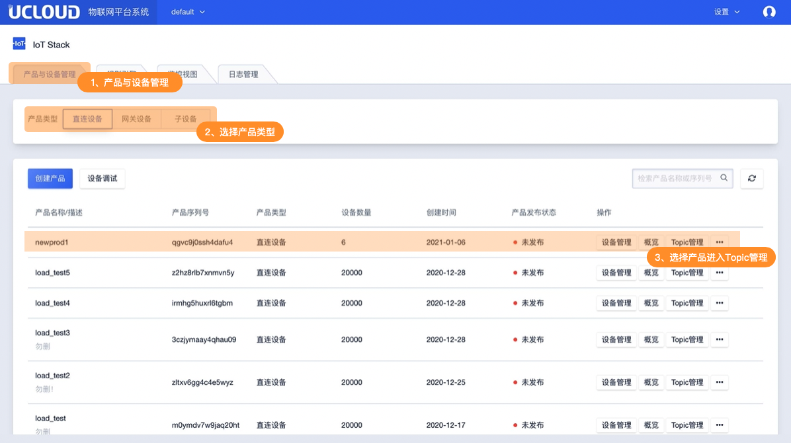
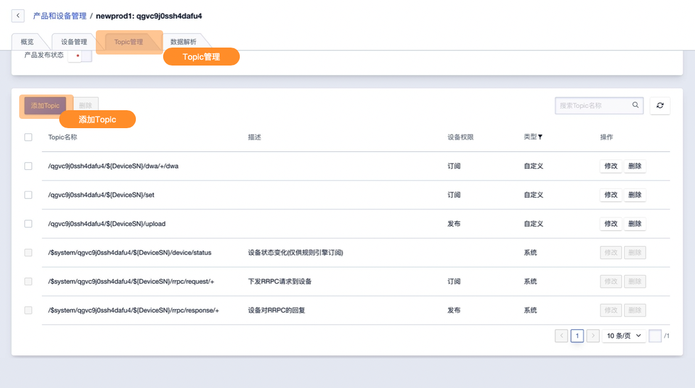
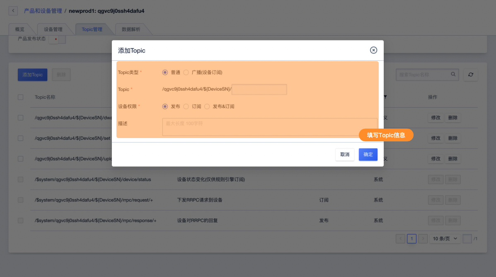
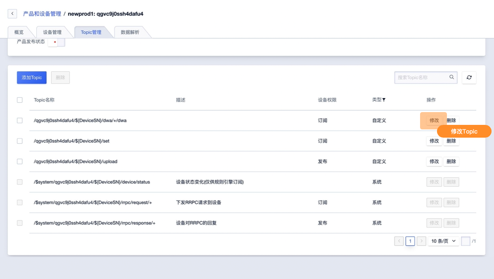

# Topic管理

是IoT平台的核心概念，也是一切消息流转的载体，IoT平台及设备以不同的Topic进行消息收发。同一产品下所有设备的Topic相同。Topic（主题）以"/"区分的一个字符串，是发布/订阅（Pub/Sub）模型中消息的传输媒介。可以向Topic发布或者订阅消息。IoT平台提供针对产品的Topic管理功能。

## 一、Topic管理说明及使用限制

Topic是跟随着产品一起定义的，在定义Topic时，路径中会使用`${DeviceSN}`标识具体设备，当该设备发布或订阅该Topic时，使用该设备的`设备序列号`来替换即可。

比如：

1. 定义某个产品的Topic为：`/70ly1tvowt696r15/${DeviceSN}/download`，具有订阅权限；
2. 某个设备的`设备序列号`为`pcur1q7jm2lb57rk`，则该设备订阅时使用Topic：`/70ly1tvowt696r15/pcur1q7jm2lb57rk/download`；

注：文档中**${ProductSN}**代表一个变量，实际使用时需要以实际的产品序列号替换，**$system**代表实际`$`为一个字符，为其组成部分。

### 1、Topic 使用规范

- Topic不可以跨越产品进行发布或者订阅
- Topic命名以正斜线`/`做层级处理，`${ProductSN}`为抽象层级，表示`产品序列号`；`${DeviceSN}`为抽象层级，表示`设备序列号`；`$broadcast`是关键词，用于添加广播类型topic（只发给按需的订阅者）
- 自定义Topic的命名以`/`分割，每层可包含字母、数字、`-`、`_`、`@`、`:`、`+`、`#`，长度限制64，编辑部分最多支持5层。`+`和`#`仅用于订阅权限Topic，`#`只能放在结尾
- Topic的权限可以设置为发布、订阅、同时支持发布和订阅
- Topic用于规则引擎筛选时，支持MQTT默认的通配符`+`，`#`

### 2、Topic权限说明

**订阅权限：**

订阅(Sub)是操作Topic的权限类型，具有从Topic中订阅消息的权限，或称为读权限。

**发布权限：**

发布(Pub)是操作Topic的权限类型，具有往Topic中发布消息的权限，或称为写权限。

**订阅&发布权限：**

同时拥有发布(Pub)和订阅(Sub)权限，即可往Topic中发布消息，也可从Topic中订阅消息。

### 3、Topic类型

**系统Topic**

系统Topic是指系统预定义的有特殊用途的Topic，此类Topic不可创建修改删除。IoT平台提供三个系统Topic。

| Topic                                                        | 权限 | 描述                                                         |
| ------------------------------------------------------------ | ---- | ------------------------------------------------------------ |
| /$system/${ProductSN}/${DeviceSN}/device/status              | 订阅 | 设备状态变化(仅供规则引擎订阅)                               |
| /$system/${ProductSN}/${DeviceSN}/rrpc/request/+             | 订阅 | 下发RRPC请求到设备                                           |
| /$system/${ProductSN}/${DeviceSN}/rrpc/response/+            | 发布 | 设备对RRPC的回复                                             |

**自定义Topic**

除IoT平台提供的系统Topic外，用户添加的Topic都为自定义Topic，此类Topic不可创建修改删除。

**广播Topic**

广播Topic是指某个产品公用的Topic，只具有订阅权限，所有该产品下的设备均可以订阅该Topic。云应用可以通过API发送数据到该Topic，所有订阅了该Topic的设备都会收到该数据。

广播Topic的格式为`/${ProductSN}/$broadcast/xxxxx`

### 4、Topic通配符

设备可以订阅含有通配符的Topic，规则引擎的消息筛选Topic设置中，可以使用通配符。

| 通配符 | 描述                                                         |
| ------ | ------------------------------------------------------------ |
| #      | 这个通配符必须出现在Topic的最后一个层级，代表本级及下级所有类目。 例如， Topic /70ly1tvowt696r15/pcur1q7jm2lb57rk/upload/#中，/upload层级后使用通配符#，代表/upload层级后的所有层级。该Topic可以代表/70ly1tvowt696r15/pcur1q7jm2lb57rk/upload/data和/70ly1tvowt696r15/pcur1q7jm2lb57rk/upload//error。 |
| +      | 代表本级所有符合的。 例如，Topic /70ly1tvowt696r15/+/upload中，代表产品下所有设备，可以代表/70ly1tvowt696r15/deviceA/upload和/70ly1tvowt696r15/deviceB/upload。 |

### 5、相关限制

* 单一产品可创建Topic数量无限制
* Topic删除后，规则引擎，消息路由中已经创建的Topic路径将失效，IoT平台不做Topic的有效性校验

## 二、Topic管理操作

### 1、添加Topic

**进入Topic管理页面**

通过首页产品与设备页面选择需要操作的产品进入Topic管理页面

**添加Topic**

进入Topic管理页面点击添加Topic

### 2、填写Topic信息

**Topic信息页面**

**Topic信息说明**

* Topic类型：【必填】依据使用用途选择普通或广播（订阅设备）
* Topic剩余部分：【必填】输入Topic的剩余层级内容，剩余部分以`/`分割，每层可包含字母、数字、`-`、`_`、`@`、`:`、`+`、`#`，长度限制64，最多支持5层。`+`和`#`仅用于订阅权限Topic，`#`只能放在结尾
* 设备权限：【必填】依据使用用途选择发布或订阅或发布&订阅
* 描述：【选填】100字符限制 无特殊符号限制    

### 3、修改Topic信息

**进入Topic管理页面**

通过首页产品与设备页面选择需要操作的产品进入Topic管理页面，找需要修改的Topic进行修改。

修改Topic同添加Topic所需信息一致文档不做特殊说明。

### 4、删除Topic

**进入Topic管理页面**

通过首页产品与设备页面选择需要操作的产品进入Topic管理页面，找需要修改的Topic进行删除。

修改Topic同添加Topic所需信息一致文档不做特殊说明。

**注意事项**

* Topic删除后，规则引擎，消息路由中已经创建的Topic路径将失效，IoT平台不做Topic的有效性校验