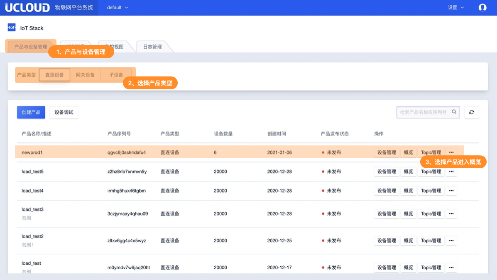
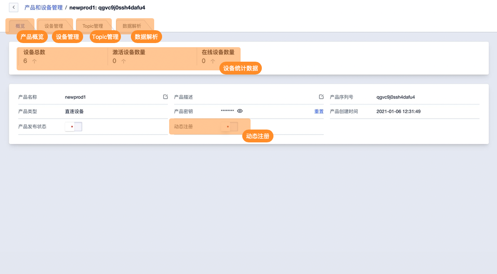

# 产品管理概述

产品是指具有相同功能的的设备的集合，产品可以理解为是设备的抽象，是一个具体型号，而设备则是产品的具体实例，拥有唯一的序列号。

使用IoT平台，需要先创建产品，然后再在相应的产品下创建设备。物联网平台会为产品创建唯一的标识符——产品序列号。

## 一、产品管理功能说明

### 1、项目管理

产品创建时确定项目管理关系，即归属用户创建产品时所在的项目。产品只归属一个项目管理，具有该项目管理权限的用户可操作改产品。任何用户都可创建、修改、删除产品。

### 2、产品类型

产品区分类型，即可创建的设备类型不同，不同设备类型的使用场景及操作方式不同。具体类型如下：

**直连设备：**

设备具备接入网络的能力

**网关设备：**

设备具备接入网络能力，绑定网关的子设备可接入网络

**网关子设备：**

设备不具有接入网络的能力，需通过网关接入网络

### 3、产品功能

这里介绍产品级别的功能，即同一个产品下的所有设备功能设置相同。不可区分该产品下不同设备进行设置。功能介绍及简介如下：

**Topic管理（主题管理）**

Topic（主题）是IoT平台的核心概念，也是一切消息流转的载体，IoT平台及设备以不同的Topic进行消息收发。同一产品下所有设备的Topic相同，以设备序列号{DeviceSN}进行区分。

**设备管理**

管理产品下所有设备，包括设备的创建删除，设备状态查看，启用禁用设备。

**数据解析**

IoT平台的标准数据格式为JSON。在实际项目中，存在一些硬件性能较弱的设备不适合直接使用JSON格式进行数据传输。为此IoT平台支持此类设备直接将原数据透传到平台并提供数据解析功能，针对原数据进行处理。IoT平台可编辑解析脚本将原数据解析成JSON并使用。同一产品下的所有设备共用一个解析脚本。

**动态注册**

当设备连接到IoT 平台时需提前在IoT平台进行注册获取产品序列号{ProductSN}、设备序列号{DeviceSN}、设备密钥{DeviceSecret}，并在激活时提供进行校验。开启动态注册后设备可无需在平台提前注册，只需提供产品序列号{ProductSN}、产品密钥{ProductSecret}即可完成激活。以用来简化整体项目的开发流程。

**产品发布状态**

未了避免误操作影响线上的产品设备，可通过产品发布状态功能关闭Topic管理、数据解析功能。

### 4、相关限制

* IoT平台可创建产品数量为256个
* 产品创建后产品序列号无法修改
* 删除产品需先删除产品下所有设备

## 二、操作指南

### 1、进入产品管理

登录后在系统首页进入产品与设备管理，选择产品类型后即可查看产品列表

### 2、产品管理主要功能概览

在产品列表中选择具体产品可进入产品概览页面。产品管理主要功能如下图所示

