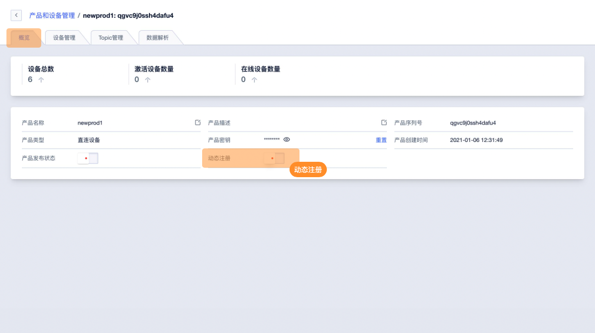
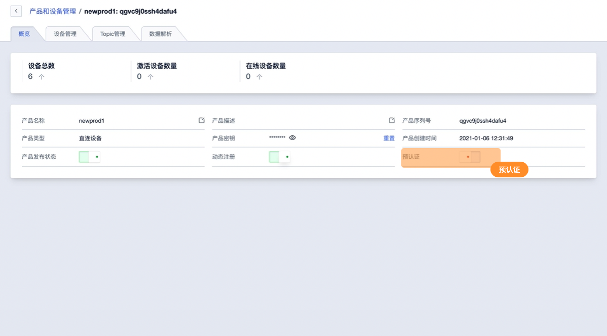
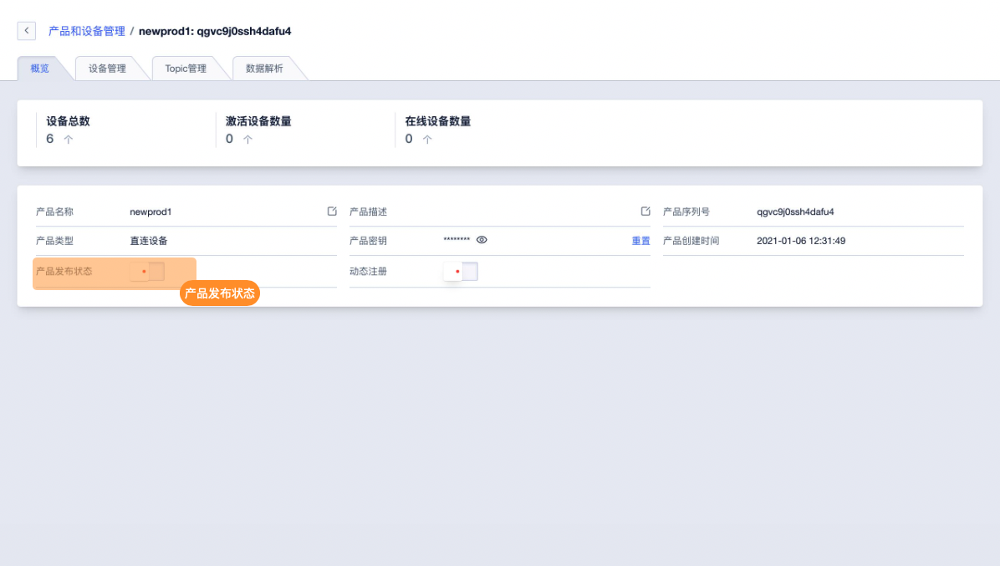
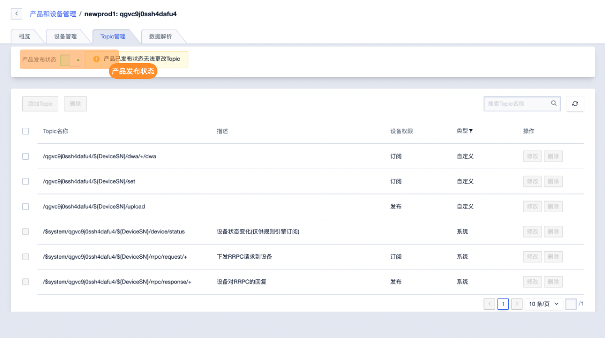
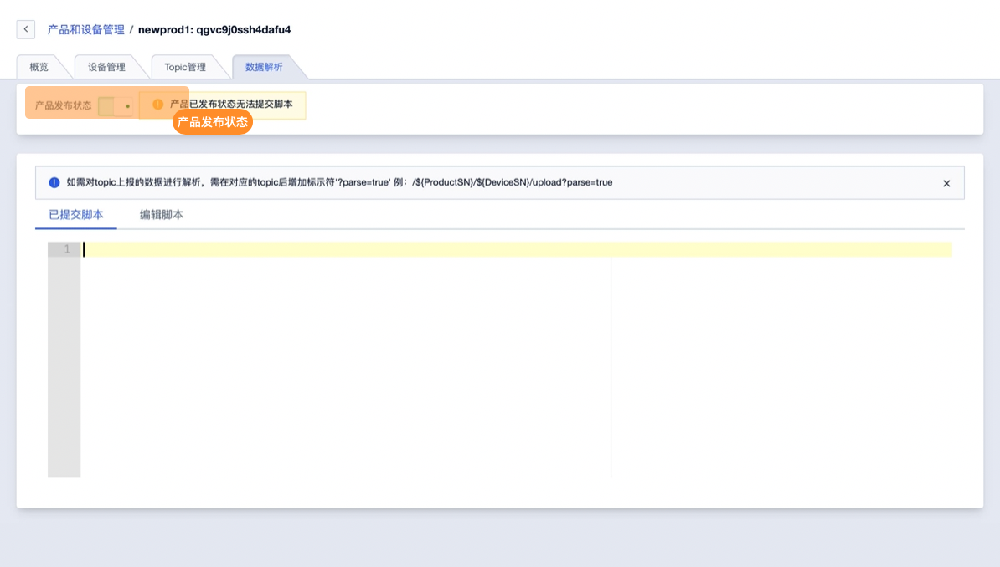

# 其他功能

产品管理其他功能包括动态注册、产品发布状态控制。

## 一、产品其他功能介绍
### 1、动态注册

当设备连接到IoT 平台时需提前在IoT平台进行注册获取产品序列号{ProductSN}、设备序列号{DeviceSN}、设备密钥{DeviceSecret}，并在激活时提供进行校验。开启动态注册后设备可无需在平台提前注册，只需提供产品序列号{ProductSN}、产品密钥{ProductSecret}即可完成激活。以用来简化整体项目的开发流程。

**动态注册逻辑流程**

当产品开启动态注册后，设备可通过产品序列号{ProductSN}、设备序列号{DeviceSN}、产品密钥{ProductSecret}上报IoT平台进行设备注册，IoT平台会分配设备密钥`{DeviceSecret}`并返回给设备。完成注册后，设备仍然需要使用三要素进行通信校验产品序列号{ProductSN}、设备序列号{DeviceSN}、设备密钥`{DeviceSecret}`

**预认证**

开启动态注册后，可选择是否开启预认证，开启预认证后，只有在产品列表添加的设备才可进行注册激活。设备需通过产品序列号`{ProductSN}`、设备序列号`{DeviceSN}`产品密钥`{ProductSecret}`进行注册获取设备密钥`{DeviceSecret}`

### 2、产品发布状态

未了避免误操作影响线上的产品设备，可通过产品发布状态功能关闭Topic管理、数据解析功能。

## 二、操作指南

### 1、动态注册

**动态注册功能**

进入产品概览页面，打开动态注册开关。动态注册开启后设备可通过产品序列号`{ProductSN}`、产品密钥`{ProductSecret}`即可完成激活。

**预认证**

开启动态注册后，可选择是否开启预认证，开启预认证后，只有在产品列表添加的设备才可进行注册激活。

### 2、产品发布状态

可在产品概览页面、Topic管理、数据解析功能页面进行产品发布状态的管理。

**产品概览页面**

**Topic管理功能页面**

**数据解析功能页面**

