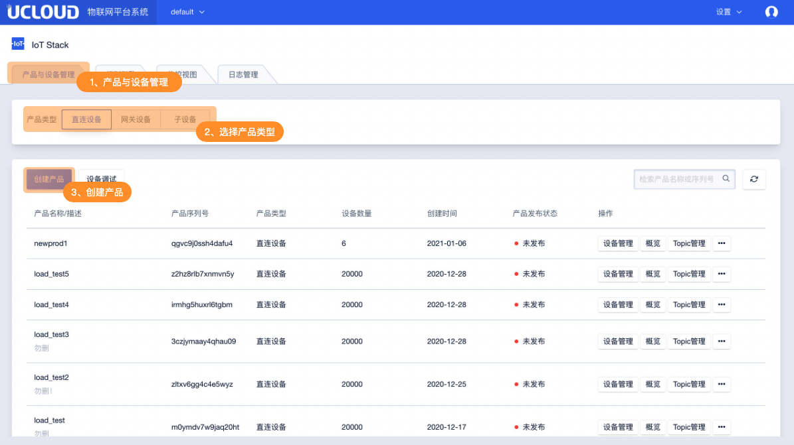
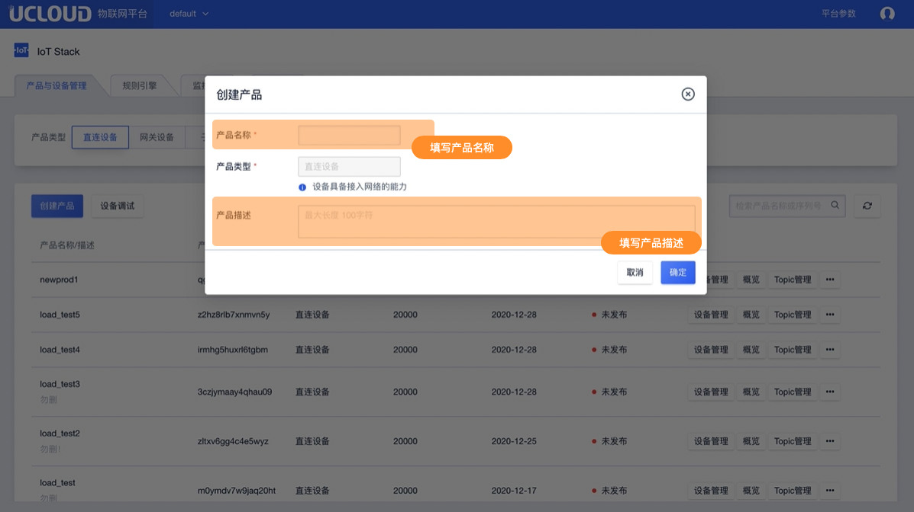
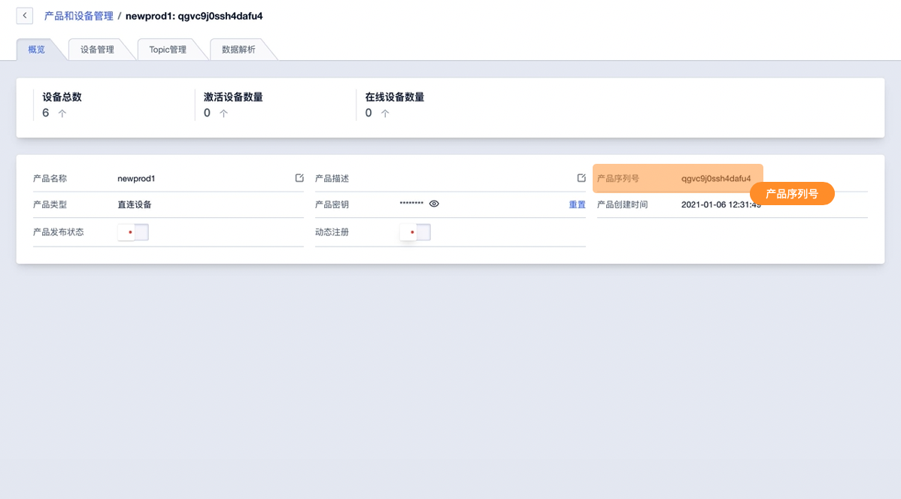
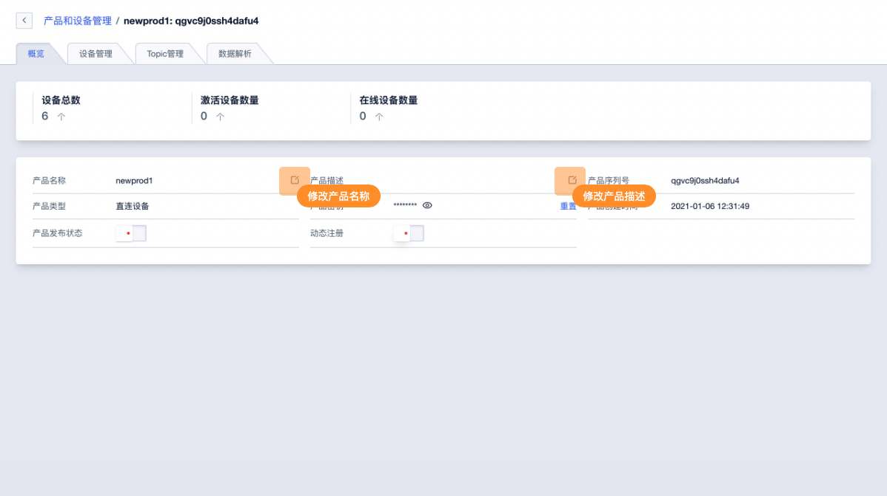
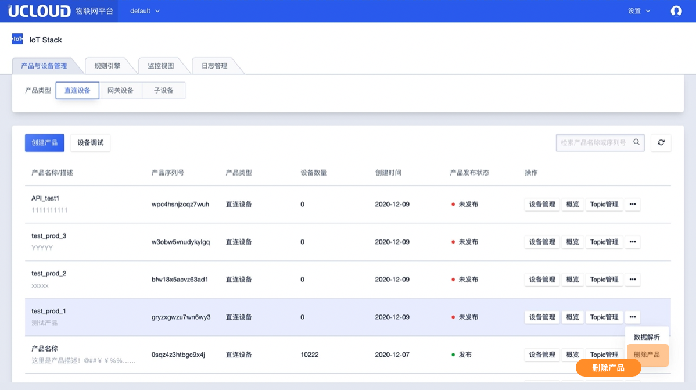

# 创建产品

在产品列表页面即可创建产品。

注：创建不同类型的产品先选择产品类型 在对应的产品列表进行创建。

## 操作指南

### 1、创建产品

**选择产品类型并创建**

创建不同类型的产品需先选择产品类型， 并在对应的产品列表进行创建。

**填写产品信息**

**产品信息说明**

* 产品名称：【必填】名称为中文、字母、数字、“_”、"-"、"@"、":"的组合，4-32位且不能为空。
  （中文算1位）
* 描述：【选填】100字符限制 无特殊符号限制    

**注意事项**

* 产品创建后产品类型不可修改
* IoT平台创建产品数量为256个

**产品序列号**

产品创建成功后会获得产品序列号（ProductSN）用于该产品下设备进行通信的标识之一，产品序列号分配后不可修改。产品序列号可在产品概览中查看。

### 2、修改产品信息

产品概览中可修改产品名称及产品描述

### 3、删除产品

在产品列表中即可删除产品

**注意事项**

* 删除产品需先删除产品下所有设备