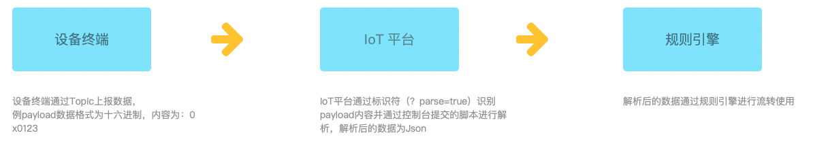
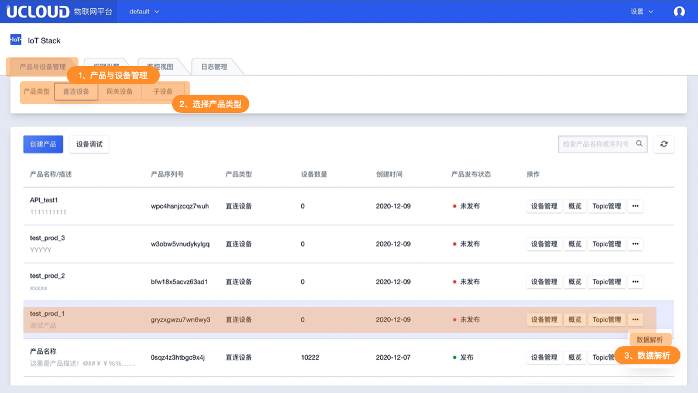
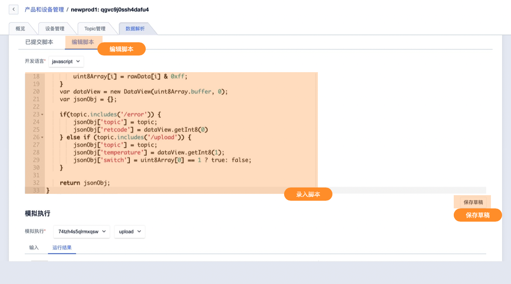
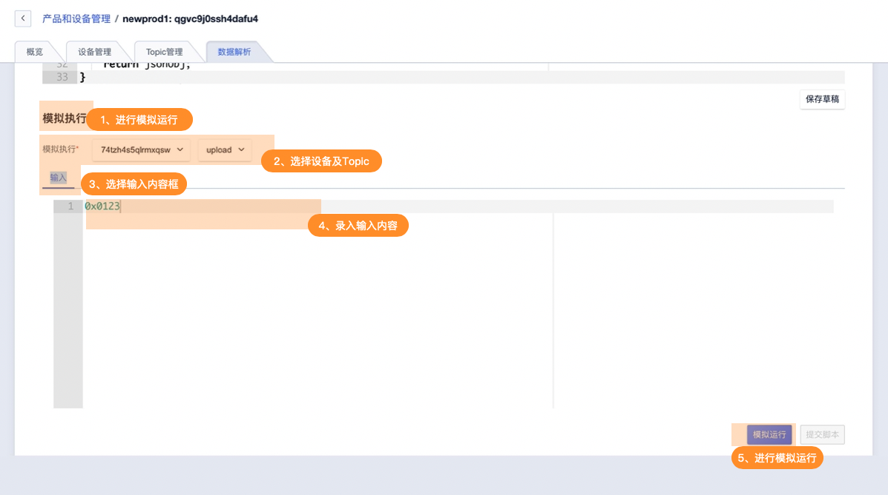
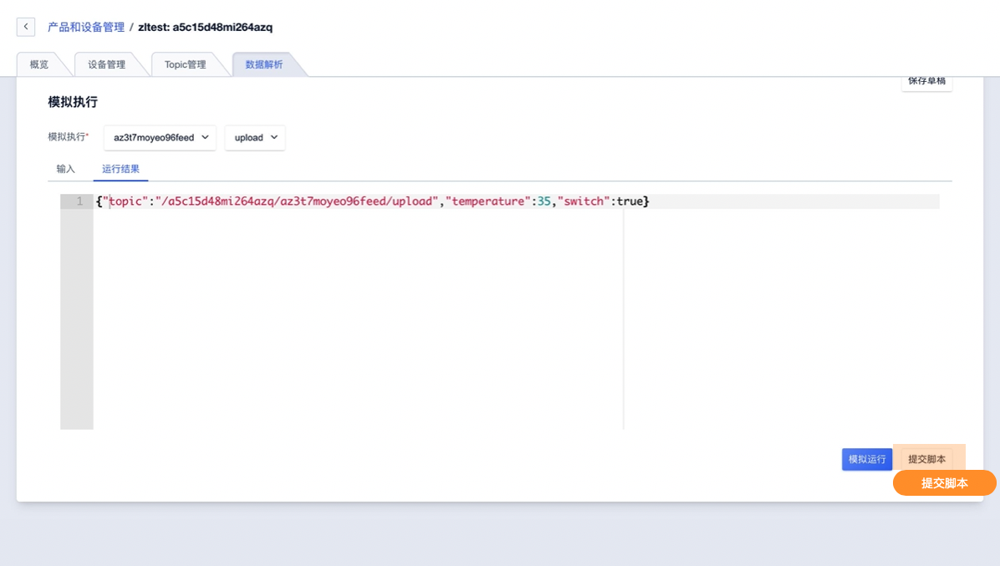

# 数据解析

IoT平台的标准数据格式为JSON。在实际项目中，存在一些硬件性能较弱的设备不适合直接使用JSON格式进行数据传输。为此IoT平台支持此类设备直接将原数据透传到平台并提供数据解析功能，针对原数据进行处理。IoT平台可编辑解析脚本将原数据解析成JSON并使用。同一产品下的所有设备共用一个解析脚本。


## 一、功能原理

### 1、解析流程



- 终端设备在上报数据时，通过在发布的topic后增加标识符?parse=true以便IoT平台识别此Topic数据需解析。
- IoT平台会执行用户预先上传的解析脚本将原数据进行转换输出的格式为JSON。
- 可通过规则引擎将转换的数据流转到其他Topic中或数据库等应用中（MYSQL、MongoDB、Kafka、TSDB、PgSQL、HTTP服务）。

###  2、功能说明

- 以产品纬度进行数据解析，相同产品下的所有设备使用的Topic共用一套解析脚本。

- IoT平台提供解析脚本编辑，支持JavaScript。

- 使用时需在解析数据的Topic后增加标识符?parse=true 以被IoT 平台识别进行解析。

  例： `/${ProductSN}/${DeviceSN}/upload?parse=true`

- 仅支持自定义Topic的数据解析，对系统Topic无效

- 仅支持具备发布权限的Topic进行数据解析


## 二、操作指南

**进入数据解析功能**

通过首页产品与设备管理进入产品列表，选择产品分类后点在需要操作产品的操作中进入数据解析功能。




**编辑脚本**

选择编辑脚本功能并在内容框内进行脚本编辑，如未编写完成可暂时先保存至草稿用于后续继续编辑。




**模拟运行**

编辑完成脚本后，需在模拟执行中模拟当前产品下某一设备通过发布权限Topic进行模拟，模拟时在输入内容框内录入需解析的Payload内容并进行模拟运行




**提交脚本**

模拟运行通过后，即可提交脚本。提交脚本后数据解析功能生效，当前产品下所有设备通过Topic增加标识符parse=true上报的数据都会被解析。




## 三、使用示例脚本

示例脚本如下

```
/*
  示例数据：
  自定义Topic：
     /update，上报数据。
  输入参数：
     topic: /$productsn/$devicesn/upload
     rawData: 0x0121
  输出参数：
  {
     "temperature": 33,
     "switch": true,
     "topic": "/$productsn/$devicesn/upload"
   }
 */
function rawDataToJSON(topic, rawData) {
    var uint8Array = new Uint8Array(rawData.length);
    for (var i = 0; i < rawData.length; i++) {
        uint8Array[i] = rawData[i] & 0xff;
    }
    var dataView = new DataView(uint8Array.buffer, 0);
    var jsonObj = {};

    if(topic.includes('/error')) {
        jsonObj['topic'] = topic;
        jsonObj['retcode'] = dataView.getInt8(0)
    } else if (topic.includes('/upload')) {
        jsonObj['topic'] = topic;
        jsonObj['temperature'] = dataView.getInt8(1);
        jsonObj['switch'] = uint8Array[0] == 1 ? true: false;
    }

    return jsonObj;
}
```

1、使用时设备需要通过Topic：/$productsn/$devicesn/upload?parse=true上报数据，否则IoT平台不会进行解析。

2、解析后的数据可通过规则引擎流转到其他Topic 或存入数据库等其他应用（MYSQL、MongoDB、Kafka、TSDB、PgSQL、HTTP服务）。

