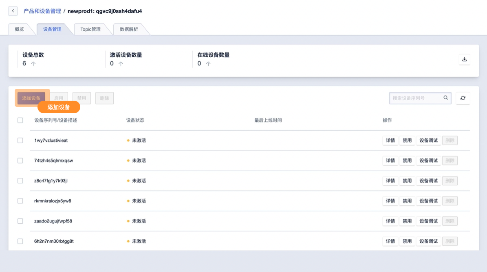
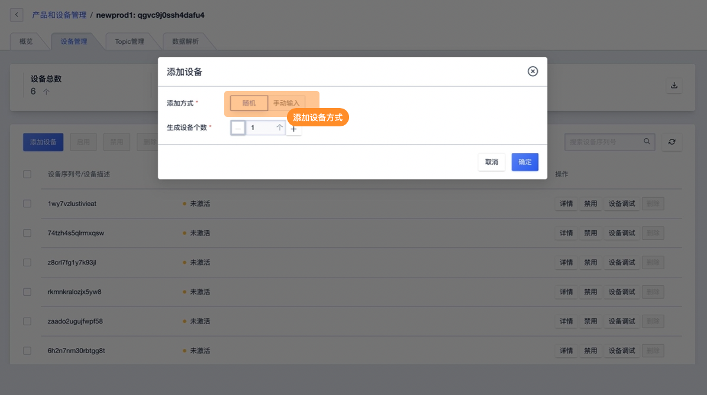
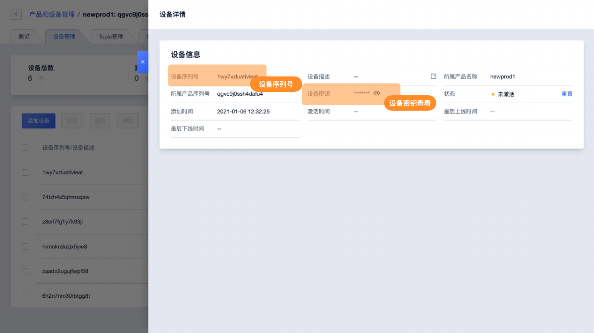
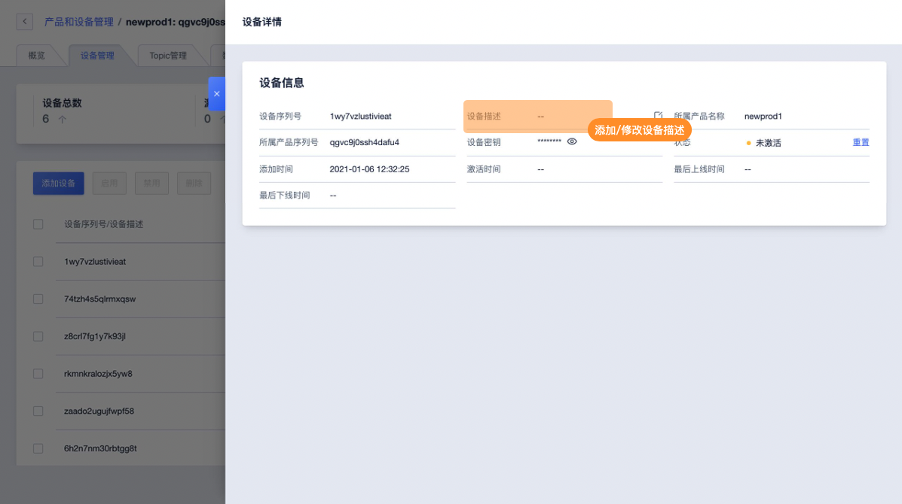
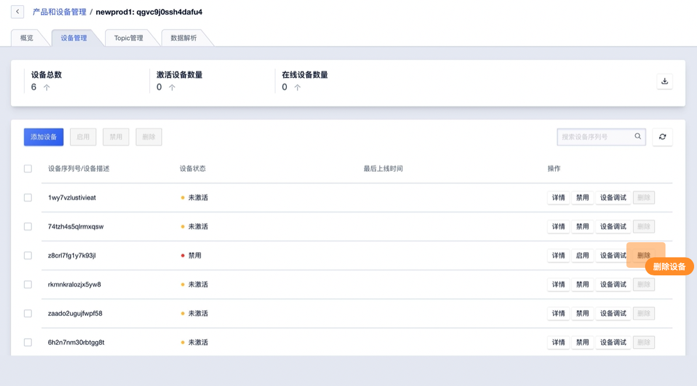

# 添加设备

IoT平台可进行设备的添加删除等操作，并可对设备进行描述添加。

## 一、操作指南

### 1、添加设备

**进入设备管理页面**

在设备管理页面通过添加设备功能进行添加

**填写设备序列号**

**设备序列号添加方式**

* 随机：【必填】写入需要创建设备的数量后 IoT平台会创建相应数量的设备并随机指定设备的序列号，输入范围1-100
* 手动录入：【必填】手工录入设备的序列号
  * 设备序列号长度为4-64个字符，可包含英文字母、数字和连接号（-）、下划线（_）、at符号（@）、英文冒号（:） ，多个序列号以换行区分 

**设备序列号及设备密钥**

* 添加设备后会获得设备序列号（DeviceSN）用于该产品下设备进行通信的标识之一，分配后不可修改。可在设备详情中查看。
* 添加设备后会获得设备密钥（DeviceSecret）用于该产品下设备进行通信的标识之一，分配后不可修改。可在设备详情中查看。

### 2、添加修改设备描述

设备详情中可添加修改设备描述以便于在操作配置中区分所需设备

### 3、删除设备

在设备管理中即可删除设备，为了避免误操作删除设备前需先禁用该设备

**注意事项**

* 删除设备需禁用该设备