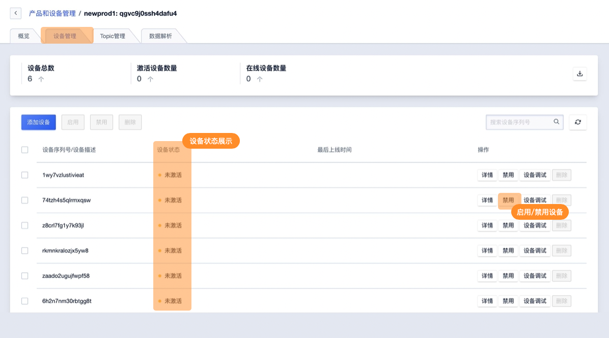
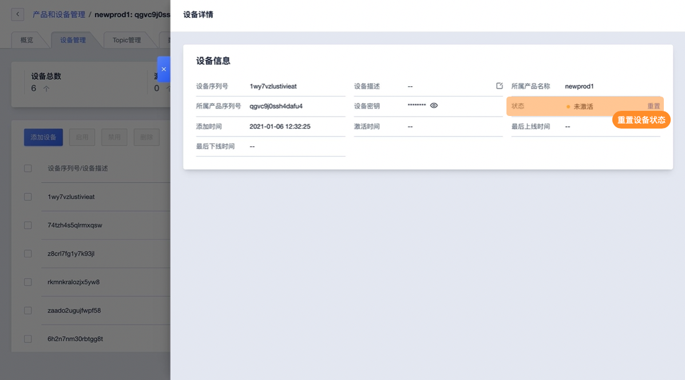

# 设备状态管理

IoT平台可查看已添加设备的包括未激活、在线、离线三个状态，并可禁用/启用设备的连接状态，也可重置设备的激活状态。

## 一、设备状态说明：

**设备激活**

设备激活也叫设备注册，指设备第一次成功连接IoT平台。如IoT平台已经添加设备，但设备未激活时设备将展示为未激活状态。

**设备在线/离线**

已激活的设备会保持在线状态；当设备因为网络或其他原因与IoT平台断开链接，设备状态会改为离线。

**禁用/启用设备**

IoT平台可主动管理设备是否可以连接到平台即禁用/启用设备。设备被禁用后将无法与IoT平台连接，启用后可恢复连接。

**重置设备状态**

已激活的设备可在IoT平台的设备详情中进行状态重置，重置后设备将为未激活状态。

## 二、操作指南

### 1、查看设备状态及

在设备管理页面可进行设备状态的查看

### 2、设备状态管理

在设备管理页面可进行设备状态启用禁用操作

在设备管理详情页面可以重置设备的激活状态

