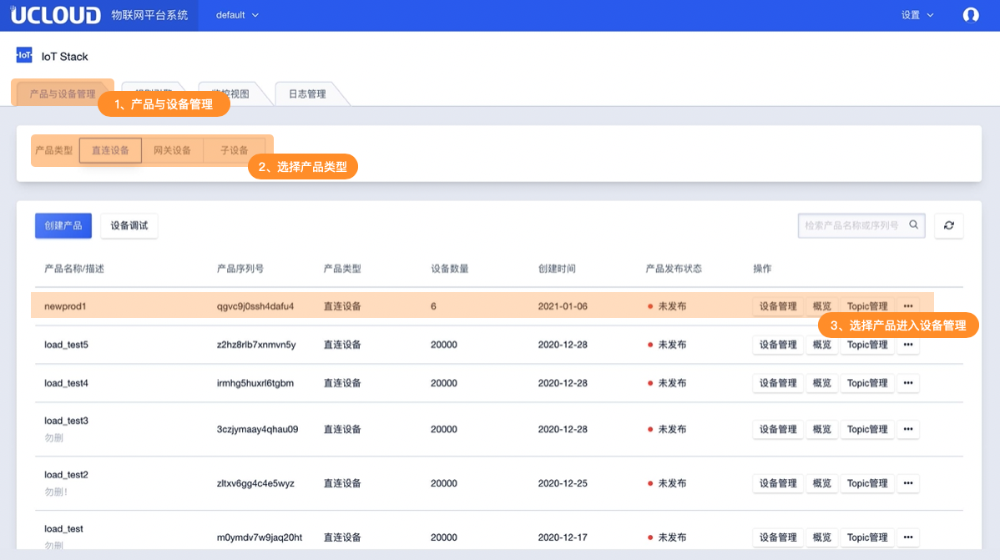
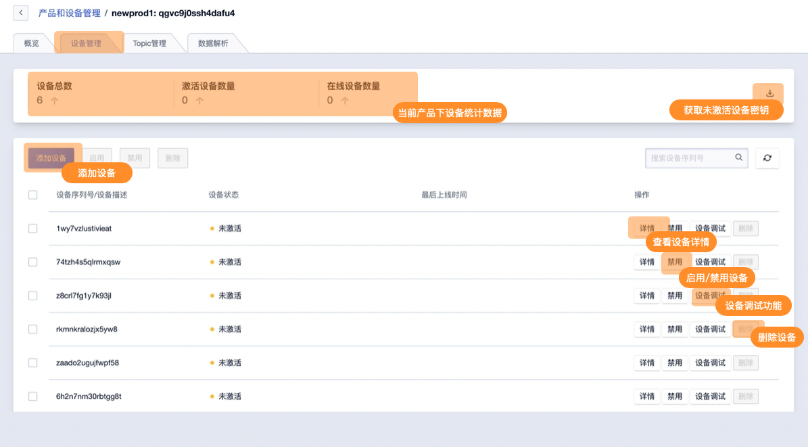
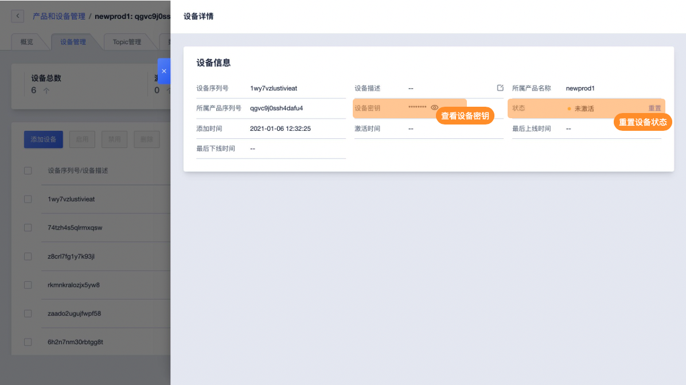
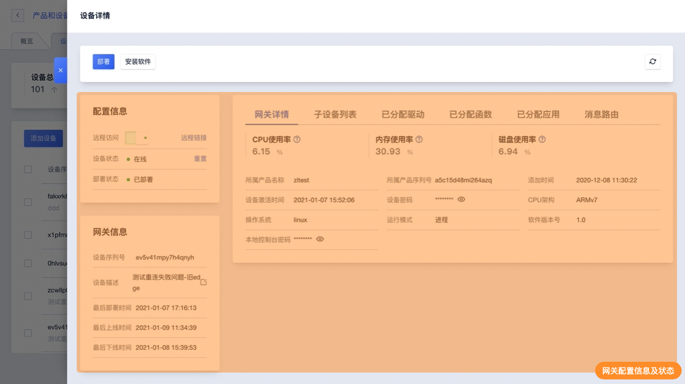
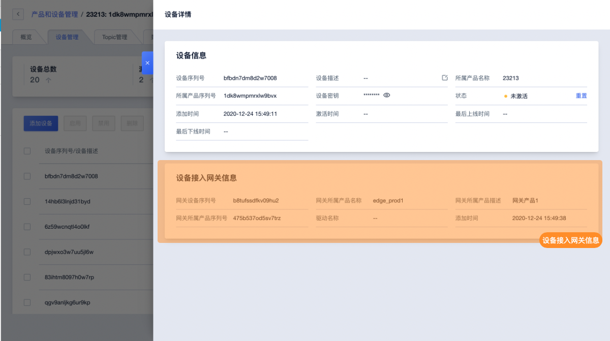

# 设备管理概述

设备是归属于某个产品下的具体设备。设备即表示某型号下切实存在的一台设备，IoT平台通过产品序列号`{ProductSN}`设备序列号`{ProductSN}`映射真实存在设备并进行管理。

## 一、管理管理说明及限制

### 1、设备登录凭证

- ProductSN：产品序列号是唯一能够标识某个产品的身份，产品序列号一经生成不能修改，而且每次设备登录都需要产品序列号的参与，所以需要妥善保管好，不要泄漏给他人；
- DeviceSN：设备序列号是唯一能够标识某个设备的身份，设备序列号可以由平台自动生成也可以使用设备的MAC地址，IEMI串号等，每次登录需要设备序列号的参与，所以请妥善保管，不要泄露给他人；
- DeviceSecret：设备密码是设备登录时候的密钥，设备密码和设备序列号成对出现，一一对应，每次登录需要设备密码的参与，所以请妥善保管，不要泄露给他人。
- ProductSecret：产品密钥是在产品开启动态注册后设备登录的使用的密钥。设备可不使用设备密钥`{DeviceSecret}`进行登录验证，可通过`{ProductSecret}`在IoT平台获取`{DeviceSecret}`并用于后登录验证，满足更多实际使用场景。

### 2、设备类型

设备类型及对应的产品类型具体类型如下：

**直连设备：**

设备具备接入网络的能力

**网关设备：**

设备具备接入网络能力，绑定网关的子设备可接入网络

**网关子设备：**

设备不具有接入网络的能力，需通过网关接入网络

### 3、设备功能

**设备状态管理**

IoT平台可查看已添加设备的包括未激活、在线、离线三个状态，并可禁用/启用设备的连接状态，也可重置设备的激活状态。

**设备调试**

为了简化物联网项目或应用的开发流程，IoT平台提供设备调试功能。可向通过控制台模拟下发Topic信息给设备并即时查看平台日志。

**获取未激活设备密钥**

如已添加的设备未激活，IoT平台可方便获取此部分设备的设备密钥`{DeviceSN}方便真实设备的批量信息烧录。

### 4、相关限制

* 删除设备需先禁用该设备以避免误操作
* IoT平台可创建的设备数量上限由授权信息license决定

## 二、操作指南

### 1、进入设备管理

登录后在系统首页进入产品与设备管理，选择产品类型后即可查看产品列表

### 2、设备管理主要功能概览

在产品列表中选择具体产品可进入设备管理页面。设备管理主要功能如下图所示

查看设备详情，因不同类型设备可展示/操作功能不同。

**直连设备**

**网关设备**

网关设备详情信息及功能说明请参见网关管理

**网关子设备**

