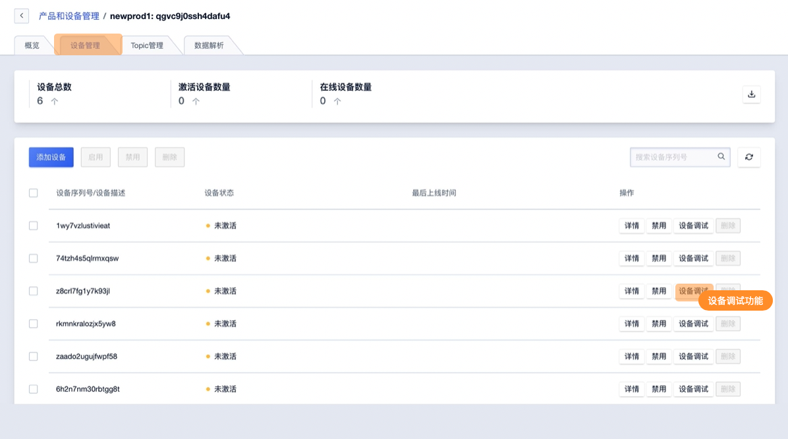
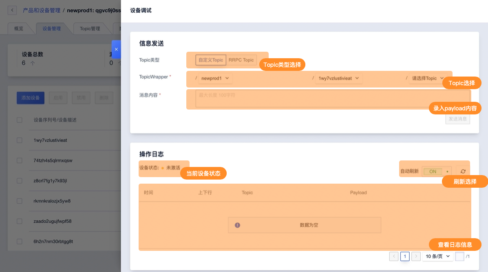

# 设备调试

为了简化物联网项目或应用的开发流程，IoT平台提供设备调试功能。可向通过控制台模拟下发Topic信息给设备并即时查看平台日志。

## 操作指南

在设备管理页面选择设备进入设备调试功能

选择需要使用的Topic类型及Topic后录入payload内容后即可向该设备下发消息。

**发送信息说明**

* Topic类型，可选自定义Topic及RRPCTopic
* Topic选择，选择需要使用的Topic
* payload内容填写需下发的消息内容

**操作日志说明**

除IoT平台下发的消息外，设备上报的消息也会显示在操作日志中

* 当前设备状态，设备调试仅可向在线的设备下发消息
* 刷新选择，可开启自动刷新（开启后 5秒/刷新一次。）或进行手动刷新日志，日志上报周期为10s一次
* 日志内容
  * 时间，生成日志的时间
  * 上下行，日志的消息方向（上行、下行）
  * Topic，消息使用的Topic
  * payload内容，消息内容