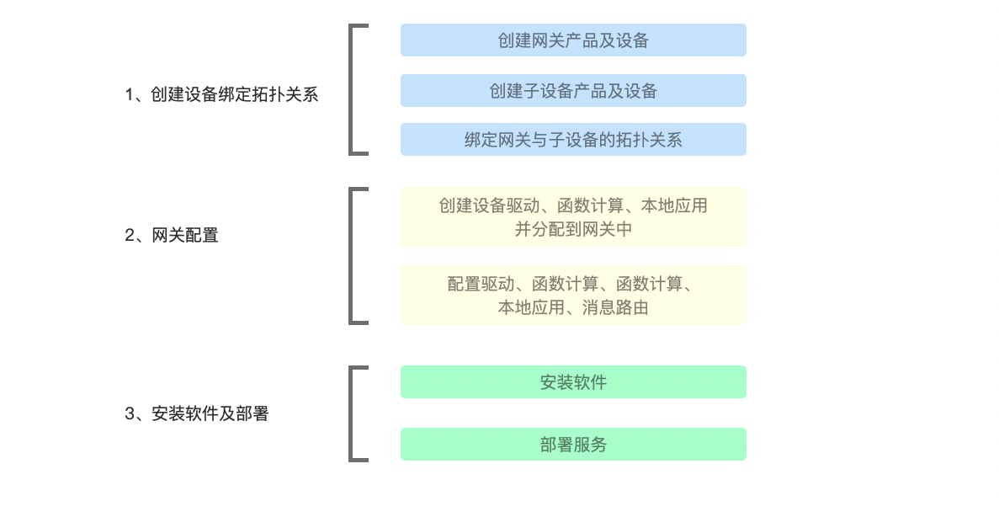

# 使用流程概述

IoT平台可以实现云边协同，高效管理网关设备、子设备、网关与子设备的拓扑关系，以及在网关设备上部署设备驱动、函数计算、本地应用消息路由等资源。使用流程如下：

### 使用流程

网关产品的配置可以分为以下步骤

**1、创建设备绑定拓扑关系**

* 在IoT平台预先创建好网关产品及设备、子设备产品及设备。
* 在网关管理的子设备列表中进行绑定（将子设备添加到网关子设备列表中）建立网关与子设备的拓扑关系。自由添加了拓扑关系后，网关才可代子设备同IoT平台进行通信。

**2、网关配置**

* 在IoT平台创建需要使用的设备驱动、函数计算、及本地应用。并将以上应用分配到所需要使用的网关中。
* 在网关设备管理中依据网关功能进行设备驱动、函数计算、函数计算、本地应用的配置，并创建消息路由规划网关内的数据流转。

**3、安装软件及部署**

* 在IoT平台的网关设备管理中获取软件安装连接，并在设备中进行安装。
* 将已配置好的网关配置通过控制台啊部署功能部署到网关设备中。

### 流程示意

