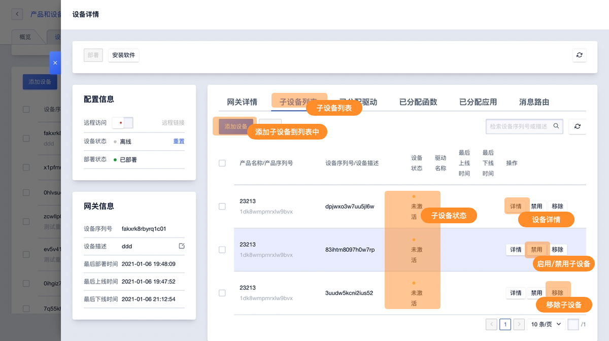
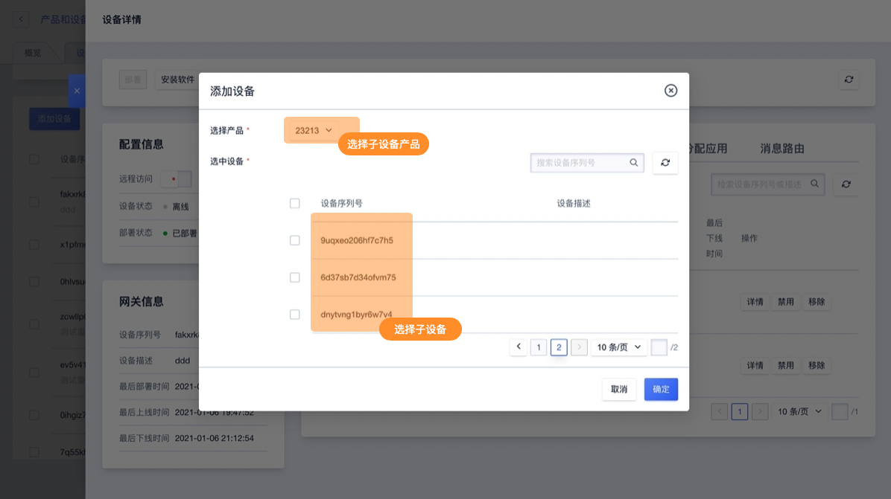

# 子设备管理

设备不具有接入网络的能力，需通过网关接入网络。添加网关拓扑关系即将子设备添加到网关的设备列表中，让网关可以代理子设备通过子设备的Topic发送或接收消息。

## 一、添加方式及注意事项

关联子设备到网关分为静态绑定和动态绑定两种：

- 静态绑定：子设备在控制台或者调用[API接口-AddUIoTCoreSubDeviceTopo](https://docs.ucloud.cn/uiot-edge/api_list/gateway_subdevice?id=adduiotcoresubdevicetopo)将子设备绑定到某个网关。
- 动态绑定：通过[子设备驱动接口调用](https://docs.ucloud.cn/uiot-edge/api_list/subdev_driver_access?id=createuiotcoreedgedriverbind)将子设备绑定到网关。

**注意事项：**

- 子设备不能直接接入IoT平台，必须要天际到某个网关的子设备列表中，通过后者代理接入IoT平台
- 子设备只能添加到一个网关
- 当网关删除时，已添加到该网关的子设备将自动移除

##  二、操作指南

**进入网关设备详情页面**

进入网关详情页面子设备列表，主要功能分布如下：

*功能说明：*

* **子设备状态说明**

  * 未激活：设备激活也叫设备注册，指设备第一次成功连接IoT平台。如IoT平台已经添加设备，但设备未激活时设备将展示为未激活状态

  * 在线/离线：已激活的设备会保持在线状态；当设备因为网络或其他原因与IoT平台断开链接，设备状态会改为离线

  **操作说明：**

  * 设备详情：进入子设备详情页面进行查看相关信息
  * 禁用/启用子设备：IoT平台可主动管理设备是否可以连接到平台即禁用/启用设备。设备被禁用后将无法与IoT平台连接，启用后可恢复连接
  * 移除子设备：将子设备从网关子设备列表中移除接触拓扑关系

**添加子设备**

在网关子设备列表点击添加设备，选择需要添加的子设备产品及设备并添加到子设备列表中。

