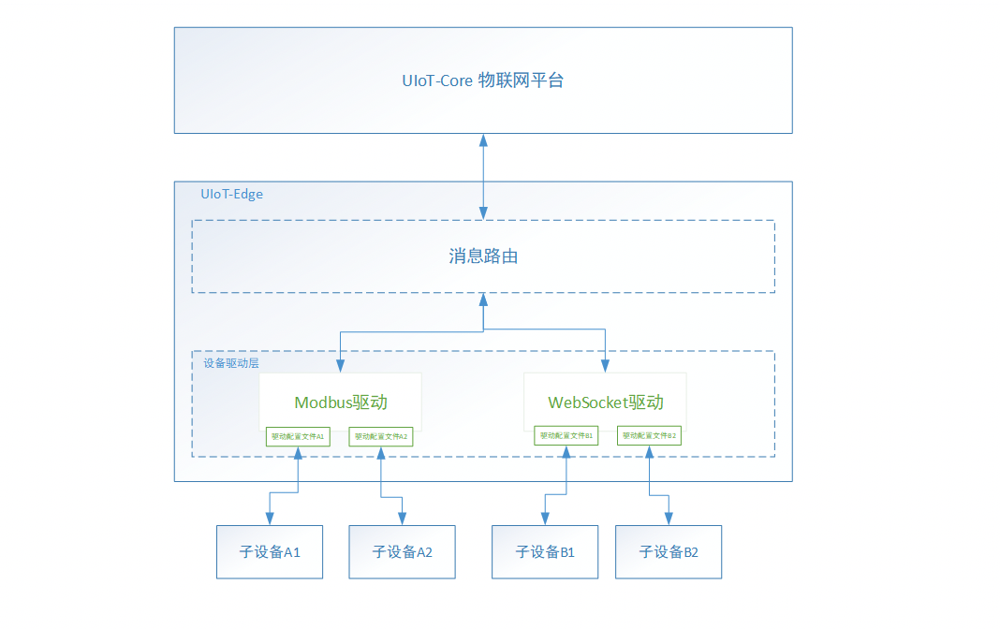

# 设备驱动概览

子设备接入是网关的核心功能，网关通常能够为那些不能直接接入IoT平台的设备提供代理，帮助子设备实现消息的上行下行。

子设备的接入通常包括数据采集传感器、工业控制设备、可编程逻辑控制器(PLC)等设备，这些设备通过不同的协议与边缘网关通信，所以需要解决多种协议接入的问题。

IoT平台提供设备驱动SDK，用户可以基于该SDK开发不同协议的设备驱动，目前官方提供Modbus 驱动

## 驱动框架支持情况

UIoT Edge子设备驱动SDK支持Python3和C语言。

| 官方驱动          | 自定义驱动                  |
| ----------------- | --------------------------- |
| Modbus（Python3） | 基于Python3驱动 SDK进行开发 |

## 子设备接入流程

1. 创建子设备，比如【温湿度传感器】
2. 选择合适的编程语言，基于子设备驱动SDK，完成Modbus、BACnet等协议驱动开发
3. 添加驱动到驱动管理列表
4. 分配驱动到网关设备，修改驱动配置文件
5. 添加子设备到该驱动，修改设备配置文件
6. 重新部署，下发驱动修改到边缘网关，子设备上报数据，驱动部署后运行框图如下图

