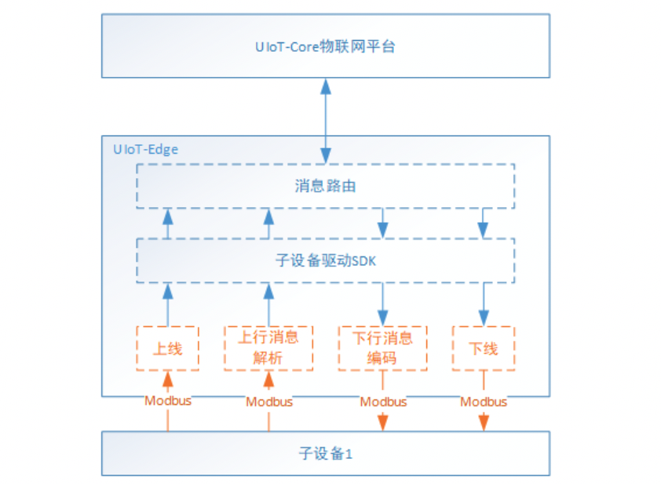
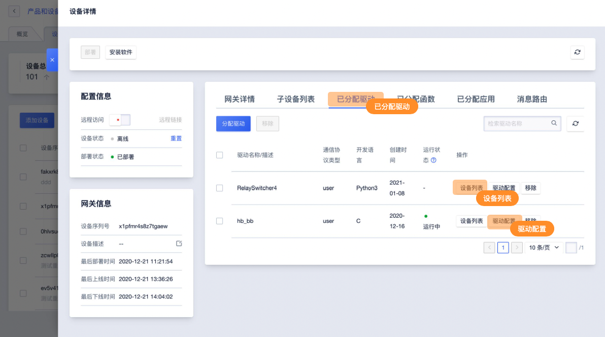
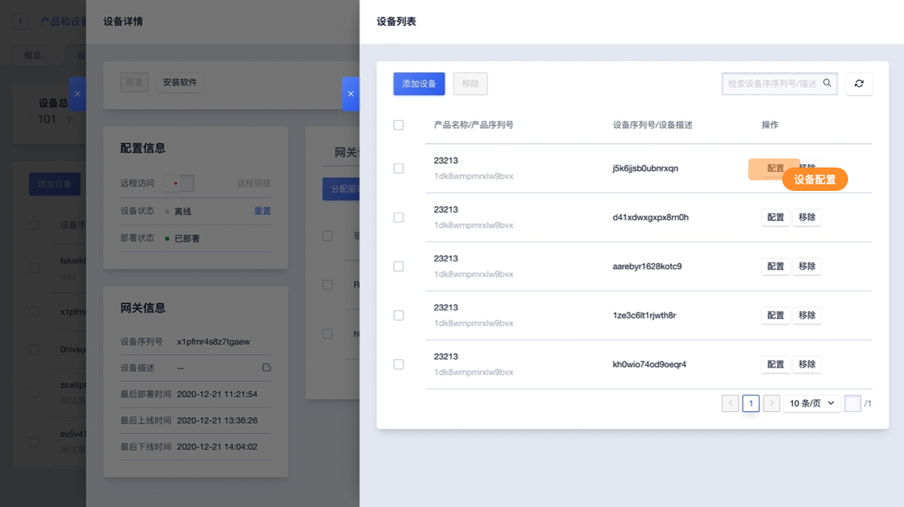
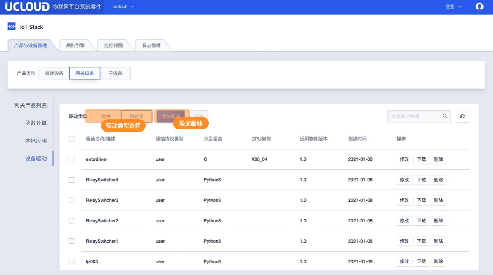
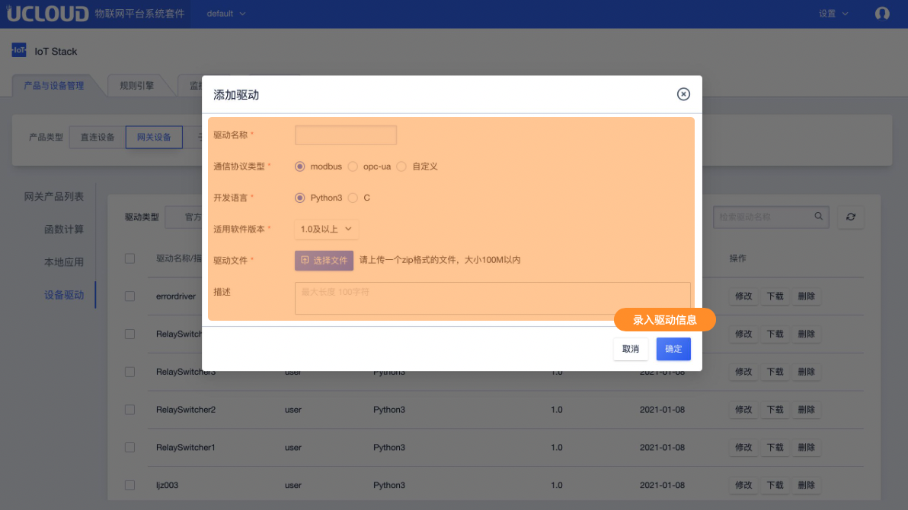

# 驱动开发及添加

## 驱动开发

驱动开发的主要任务是完成子设备的上线、下线以及数据的收发。

### 驱动示例

本例通过官方驱动示例【RelaySwitcher】讲解如何开发设备驱动。

子设备驱动主要工作是实现子设备与边缘网关之间的通信，具体功能包括解析并转发子设备上报的数据，监听云端下行的数据并转发给子设备，同时完成设备的上下线。



#### 一个简单的驱动实现（代码以示意为主）

```c
# 主函数
if __name__ == "__main__":
        # 1. 获取驱动及子设备配置信息
        driverConfig = Config().getDriverInfo()
        deviceInfoList = Config().getDeviceInfos()

        # 2. 从子设备列表中获取第一个设备的设备信息及子设备配置               
        subDeviceInfo = deviceInfoList[0]
        productSN = subDeviceInfo['productSN']
        deviceSN = subDeviceInfo['deviceSN']
        deviceConfig = subDeviceInfo['config']

        # 定义驱动收到下行消息后的处理逻辑
        def callback(topic: str, payload: b''):
            log.info("recv message from {} : {}".format(topic, str(payload)))

        # 3. 创建一个SubDevice对象，注册收到消息后的回调
        #    所有对该设备的操作都是基于该对象，比如子设备的消息上下行、设备上下线
        subDevice = SubDevice(product_sn=productSN,
                              device_sn=deviceSN, on_msg_callback=callback)
        # 4. 子设备上线
        subDevice.login()

        # 5. 上报消息Topic，实际可以通过配置文件指定
        topic = "/{}/{}/upload".format(productSN, deviceSN)
        i = 0
        while True:
            # 获取子设备属性，用户需要根据实际业务定义
            relayStatus = ("on", "off")[i % 2 == 0]
            payload = {
                "timestamp": time.time(),
                "relayStatus": relayStatus
            }
            byts = json.dumps(payload).encode('utf-8')

            # 上报消息到消息路由
            subDevice.publish(topic, byts)
            log.info("uplaod {} : {}".format(topic, str(byts)))
            time.sleep(5)
            i = i+1CopyErrorSuccess
```

### 驱动相关配置

#### 驱动配置

驱动配置在【网关详情】 -> 【已分配驱动】->【驱动配置】修改，驱动配置一般包括两方面内容：

1）网关与子设备通信使用的通道等信息配置。以Modbus为例，比如channel1 = /dev/ttyS0, 9600, 8N1;

2）子设备属性集合表，即子设备协议指令获取的属性值如何转换成上云的协议字段。以Modbus为例，比如属性集为properties1，定义Modbus读取属性指令为`功能码0x04 寄存器地址0x01 读取数据长度0x01`，则对应上云的字段为`temperature`，则驱动会根据配置信息将上述指令读到的数据转为`{"temperature": 20}`上报到云端。

#### 子设备配置

子设备配置在【网关详情】 -> 【已分配驱动】->【设备列表】->【修改配置】中修改，子设备配置主要包含以下几部分：

1）使用的通道。比如使用的上述驱动配置中的channel1；

2）使用的属性集。比如使用上述驱动配置中的properties1；

3）自身的信息。比如从地址 slaveId = 1；

4）轮询方式，轮询周期等。比如 period = 5；





**下一步**，添加驱动，并分配给网关，部署测试。

## 添加驱动

驱动开发完成后，可以添加驱动并进行测试：

- 将驱动上传到驱动管理，见本节操作步骤
- 通过下一节的分配驱动，将驱动分配给相应的边缘网关设备，并添加设备；
- 通过下一节的部署驱动，进行测试、使用。

### 操作步骤

1. 选择<驱动管理>标签

2. <官方/自定义>：选择官方驱动或自定义添加驱动，官方驱动包括RelaySwitcher示例和Modbus驱动

3. 点击<新增驱动>，在弹出的对话框中输入驱动相关信息

   - 驱动名称：驱动的名称，比如Modbus-RTU
   - 通信协议类型：驱动应用的子设备通信协议，比如Modbus、Bluetooth、自定义等；
   - 开发语言：驱动使用的开发语言，支持Python3和C两种；
   - CPU架构：当驱动开发语言为C语言是，需要选择CPU架构，分为x86_64、armv7、armv8；
   - 适用软件版本：可以在UIoT Edge哪个版本上使用；
   - 驱动描述：对驱动的描述；
   - 驱动上传：上传驱动，支持zip格式文件，大小<100M；

4. 点击<确定>，添加**驱动**成功；

5. 添加驱动成功后，可以在驱动列表中查看该驱动

   - 基本信息：驱动名称、驱动描述、通信协议类型、开发语言、CPU架构、适用软件版本、创建时间等；
   - 操作：
     - 修改：对驱动进行修改，仅支持驱动名称、适用软件版本、驱动描述、驱动文件的修改
     - 下载：下载该驱动文件
     - 删除：可以删除该驱动，删除驱动需要先移除该驱动与网关的分配关系，参考分配驱动

6. <批量删除>：同时选择多个驱动，点击<删除>按钮，可以批量删除驱动；

   > **注：驱动删除需要先移除驱动与网关的分配关系，参考分配驱动**



