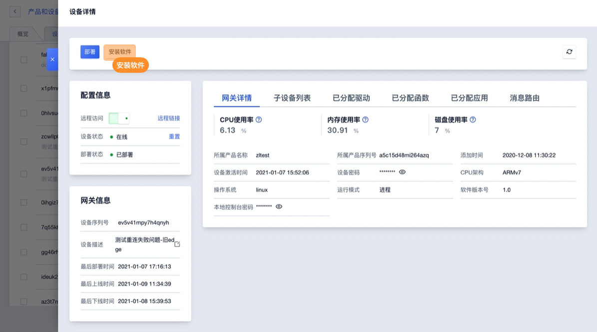
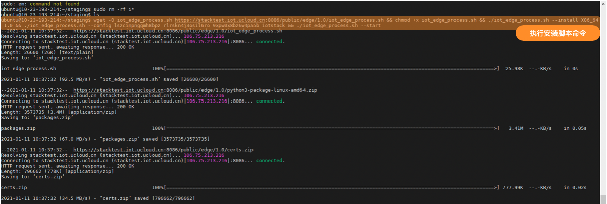

# 安装软件

安装软件是指将IoT平台的网关软件包（IoT Edge）安装到边缘硬件中，IoT平台可依据网关硬件生成安装脚本便于安装。


## 一、支持硬件说明

### 1、硬件要求

**CPU架构要求：**

可以运行linux系统的硬件设备，架构包括：x86、armv7、armv8。


**操作系统要求：**

仅支持运行在linux下，暂不支持其他内核版本及windows系统。

linux推荐使用以下发行版本，自裁剪系统或其他发行版本将在后续版本中陆续支持，敬请期待：

- x86_64：ubuntu18.04、centos7.0
- armv7：raspbian GNU、ubuntu18.04
- armv8：ubuntu18.04


**最小运行资源要求：**

| 参数     | 进程版                                      | Docker版                     |
| -------- | ------------------------------------------- | ---------------------------- |
| CPU架构  | x86_64(amd64) armv8(aarch64) armv7(aarch32) | x86_64(amd64) armv8(aarch64) |
| CPU主频  | ≥528MHz                                     | ≥1.2GHz                      |
| 内存     | ≥256MB                                      | ≥2GB                         |
| 硬盘     | ≥128MB                                      | ≥2GB                         |
| GPU/NPU  | 可选                                        | 可选                         |
| OS       | linux kernel version ≥4.1                   | linux docker version ≥18.09  |
| 端口占用 | 19980(本地Web Portal)                       | 19980(本地Web Portal)        |


####  2、安装依赖

uiot edge的安装以及正常运行需要依赖于wget、unzip、python、sshd/dropbear等组件，请确保以下组件存在并且版本能够达到要求并且sshd服务处于启动状态。

| 依赖组件      | 版本要求 |
| ------------- | -------- |
| sshd/dropbear | -        |
| python        | ≥3.6     |
| wget          | -        |
| unzip         | -        |


## 二、操作指南

### 1、网关安装

**进入网关设备详情页面**

进入网关产品设备列表找到需要安装软件的网关，进入设备详情页面。




**进入安装软件弹窗并填写安装信息**


**录入信息说明**

* CPU架构：【必填】可选ARMv7、ARMv8_64、X86_64
* 适用软件版本：【必填】
* 操作系统版本：【必填】
* 运行模式：【必填】
* 本地控制台密码【必填】：8-20位字母数数字组合 默认为iotstack


**获取安装脚本**


**安装软件包**

登录网关设备，进入安装IoT Edge的目录，粘贴并运行上述获取的命令脚本。



系统会自动下载安装软件包，并启动IoT Edge运行。运行成功后可在控制台查看网关在线状态为 在线。


**查看网关运行状态**


### 2、停用IoT Edge

登录目标边缘网关，在安装目录下，找到脚本`iot_edge_process.sh`，执行以下命令：

```bash
iot_edge_process.sh --stop allCopyErrorSuccess
```


### 3、重装软件

* 重装软件与第一安装软件操作流程一致
* 重新安装，会覆盖网关已经部署的所有配置，并需要重新部署

 