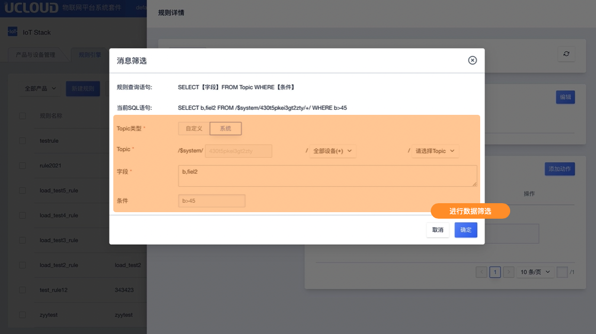

# 数据流转管理

数据的流转是通过一种类似SQL语句的方式，对Topic消息内容进行筛选，将筛选的数据流转到目的地。

## 一、数据流转说明

### 数据流转JSON和binary数据类型的区别：

- JSON：JSON格式对于文档数据会先进行数据解析，提取Json中的字段，再进行数据的流转。如果是非Json格式的数据将会被规则引擎直接丢弃；
- binary：binary格式仅支持自定义Topic类，只做数据透传，不能流转到结构化存储的目的地中（只能流转到其他Topic中以及HTTP服务中）；规则中的字段支持星号"*"，或者是部分内置函数；

## 二、操作指南

### 1、消息筛选

在规则详情页面进入编辑消息筛选

**筛选内容说明**

消息筛选的的规则查询语句为：`SELECT【字段】FROM【Topic】WHERE【条件】`

- Topic：分为系统Topic和自定义Topic。系统Topic是设备状态RRPC等系统预留的Topic；自定义Topic是用户自己定义的Topic，以`/`分割，可包含字母、数字、`-`、`_`、`@`、`:`、`+`、`#`，支持五层，长度限制64，`+`和`#`为通配符`#`只能放在结尾。具体可以根据需求选择产品，选择相应的Topic。
- 字段：字段支持内置函数、JSON表达式、星号`*`，参考SQL表达式特性
- 条件：支持比较运算符、逻辑运算符、括号运算符、算数运算符、函数调用、JSON表达式、CASE语句、IN、LIKE操作；具体参考SQL表达式特性

### 2、添加动作

在规则详情页面进入添加动作 具体操作详见添加动作

