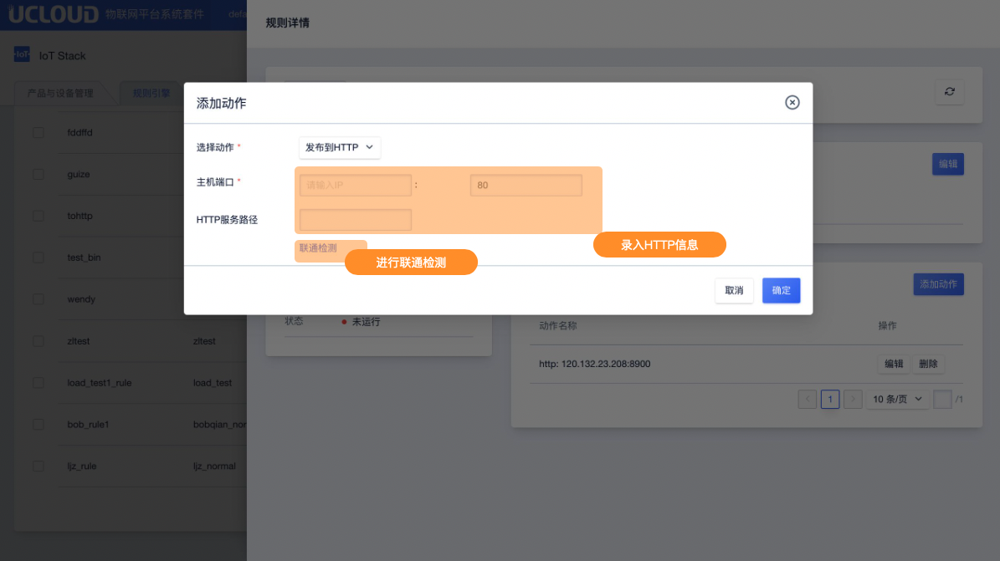

# 发布到HTTP

发布到HTTP的支持JSON及binary类型的规则引擎。

## 操作指南

在规则引擎规则详情页面中，点击<添加动作>后选择动作"发布到HTTP"

**录入信息说明**

* 主机端口：填写实例IP及端口号

   - HTTP服务路径：提供服务的剩余路径，比如`temperature`；该服务通过内网转发，会自动拼凑出服务URL，比如`http://10.x.x.x:80/tmperature`

 

**联通检测**

数据库信息填写完成后，可通过联通检测进行联通性校验。