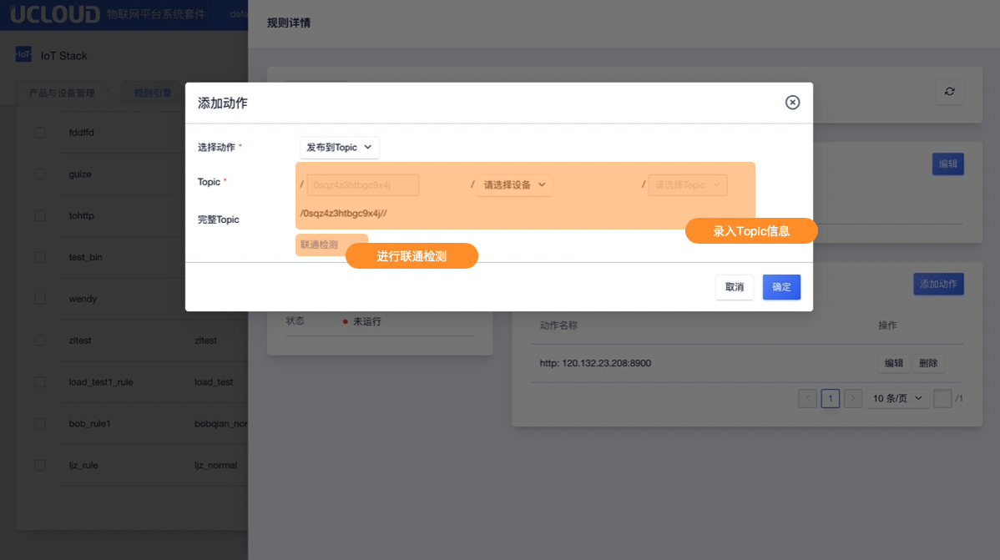

# 存储到Topic

发布到Topic是指将筛选的消息数据转发到另外一个Topic上，从而实现M2M通信。

发布到Topic支持JSON及binary类型的规则引擎。

## 操作指南

在规则引擎规则详情页面中，点击<添加动作>后选择动作"发布到Topic“

**录入信息说明**

发布到Topic需录入完整的Topic路径 包括：

* 产品序列号：系统默认填写当前产品序列号
* 设备序列号：填写需选择流转目的的设备序列号
* 剩余Topic：选择剩余部分Topic
* 变量：当规则引擎数据类型为JSON时，设备序列号可由消息筛选中过滤出的字段填写

**联通检测**

数据库信息填写完成后，可通过联通检测进行联通性校验。