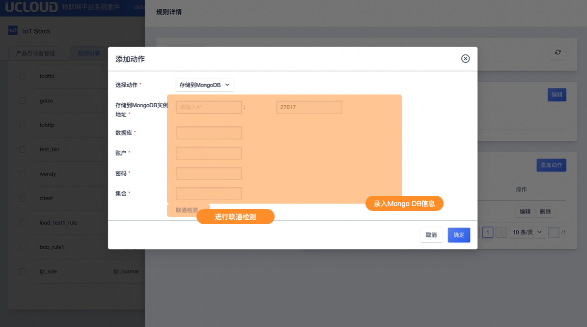

# 存储到MongoDB

存储到MongoDB仅支持JSON类型的规则引擎。

## 操作指南

在规则引擎规则详情页面中，点击<添加动作>后选择动作"存储到MongoDB"

**录入信息说明**

- MongoDB实例：填写实例IP及端口号
- 登录账户： MongoDB的登录用户名
- 登录密码：MongoDB的登录密码
- 数据库： 使用MongoDB的哪个数据库
- 集合： 使用MongoDB的哪个集合

**联通检测**
数据库信息填写完成后，可通过联通检测进行联通性校验。