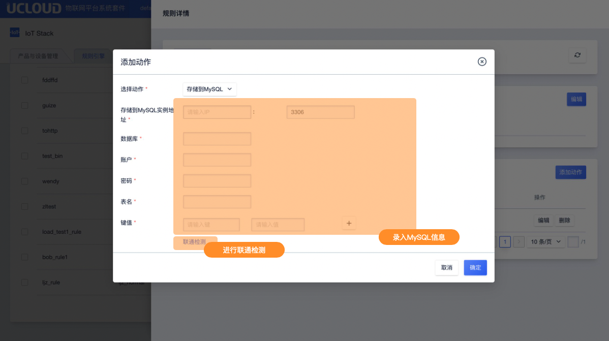

# 存储到MySQL

存储到MySQL仅支持JSON类型的规则引擎。

## 操作指南

在规则引擎规则详情页面中，点击<添加动作>后选择动作"存储到MYSQL"

**录入信息说明**

- MYSQL实例地址：填写实例IP及端口号
- 数据库： 使用MYSQL的哪个数据库
- 账户： MYSQL使用数据库的账户名称
- 密码：MYSQL数据库的使用密码
- 表名：使用MYSQL所选数据库的哪个表
- 键值：键指的是表的字段名，值是消息筛选中的JSON数据键。比如需要流转的消息为：`{"a":1,"b":2}`，SQL筛选语句为：`SELECT * FROM /70ly1tvowt696r15/00:14:32:e1:72:f1/upload`，需要存储到MYSQL的数据库:表为`Database:Table1`，字段分别为`Column1,Column2`，则执行动作的键值可以写为：

| 键      | 值   |
| ------- | ---- |
| Column1 | ${a} |
| Column2 | ${b} |

**联通检测**

数据库信息填写完成后，可通过联通检测进行联通性校验。