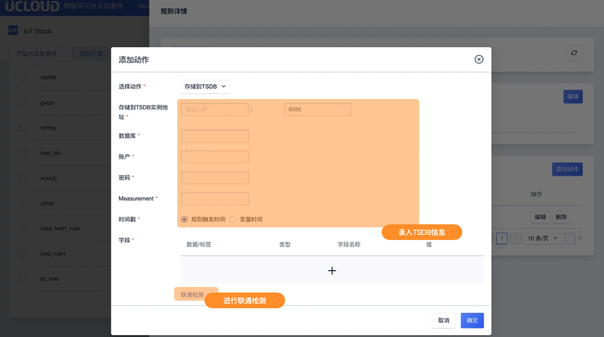

# 存储到TSDB

存储到TSDB仅支持JSON类型的规则引擎。

## 操作指南

在规则引擎规则详情页面中，点击<添加动作>后选择动作"存储到TSDB"

**录入信息说明**

-  TSDB实例地址：填写实例IP及端口号

* 账户： TSDB的登录用户名；

- 密码：TSDB的登录密码；
- 数据库：转存的TSDB数据库；
- Measurement ：转存的TSDB的Measurement名字；
- 时间戳：Unix时间戳；
  - 规则触发时间：指写入记录时使用该条规则触发的时间作为该记录的时间戳；
  - 变量时间：指以变量的值作为该条就的时间戳，变量名为timestamp则表示为${timestamp}；
- 字段：存储的filed或tag名和消息筛选中的值；
  - tag: 存储为tag，为string格式，存储格式如下表；
  - filed：存储为filed，支持float、int、string、boolean格式，存储格式如下表；

| 字段名称 | 值   |
| -------- | ---- |
| filed1   | ${a} |
| tag1     | ${b} |

**联通检测**

数据库信息填写完成后，可通过联通检测进行联通性校验。