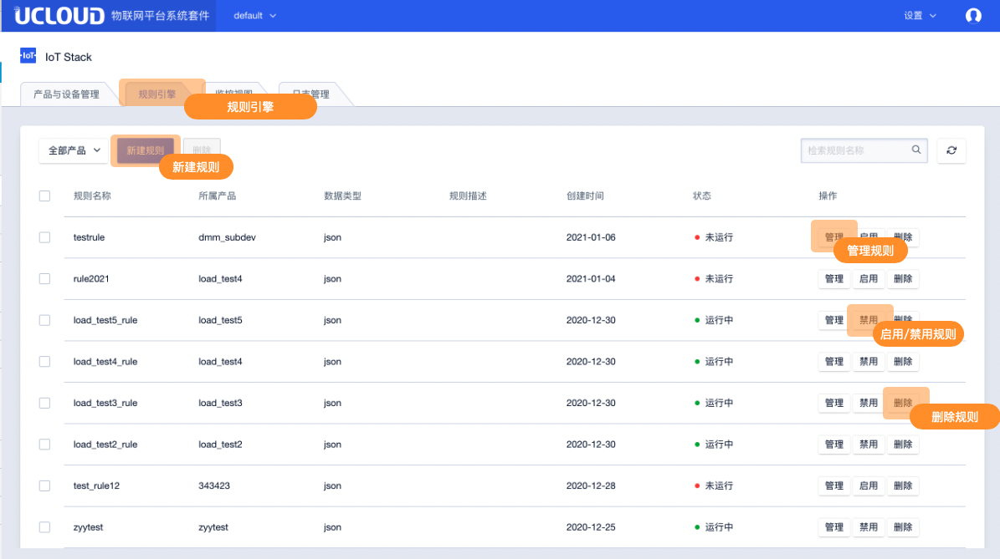
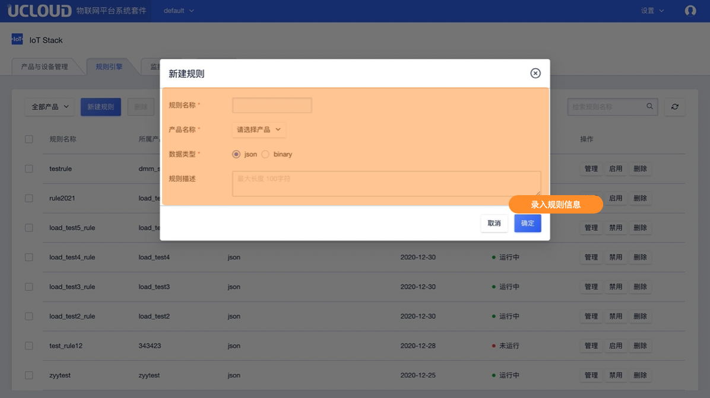
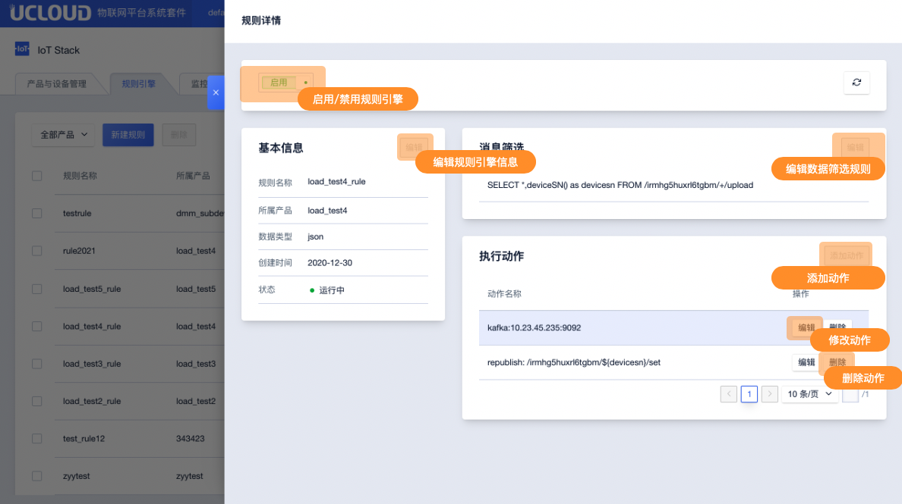

# 规则引擎

规则引擎是基于Topic的数据流管理。设备端基于Topic上报的数据可以通过规则引擎进行数据的流转，转发到其他存储服务或应用服务中，此功能用户无需进行代码开发。

## 一、规则引擎功能说明

### 1、流转范围

规则引擎只能在同项目下的项目产品内进行流转。

### 2、规则引擎类型

规则引擎依据Topic中payload的内容格式分为Json和binary。

### 3、数据筛选

规则引擎支持以SQL表达式的方式进行数据筛选

### 4、流转目的地（动作）

依据规则引擎的类型不同可流转的目的地不同。

**JSON类型支持流转目的地：**

* 存储到MySQL中
* 存储到MongoDB中
* 存储到TSDB（时序数据库）中
* 发布到Kafka（分布式消息系统）中
* 发布到其他Topic（实现M2M，设备到设备的消息转发）
* 发布到HTTP服务

**binary类型支持流转目的地：**

* 发布到其他Topi（实现M2M，设备到设备的消息转发）
* 发布到HTTP服务

###  5、规则状态

规则引擎支持启用禁用状态管理，当规则临时不用时可禁用该条规则无需删除。

## 二、操作指南

### 1、进入规则引擎

在IoT平台首页进入规则引擎功能，主要功能如下：

### 2、新建规则

在规则引擎页面新建规则填写规则信息

**规则信息说明：**

* 规则名称：【必填】中文、字母、数字、“_”、"-"、"@"、":"的组合，4-32位且不能为空
* 产品名称：【必填】选择规则需要流转的产品，创建后不可修改
* 数据类型：【必填】选择数据类型，创建后不可修改

### 3、规则详情

创建好规则后进入规则详情页面主要功能如下：

**功能说明：**

* 启用禁用规则引擎：规则引擎启用后方可生效对符合规则的数据进行流转，启用前IoT平台会进行联通校验，如不通过则不可启用。启用中的规则引擎不可进行修改
* 编辑规则引擎信息：可修改规则引擎名称及描述，对于规则引擎的产品归属及数据类型不可修改
* 编辑数据筛选规则：编辑需要过滤的数据，详见数据流转管理
* 添加执行动作：添加该条规则执行的动作，详见数据流转管理
* 修改动作：修改已添加的动作
* 删除动作：删除已添加的动作

### 4、删除规则

 在规则引擎功功能页面即可删除已经创建的规则，运行中的规则不可删除

