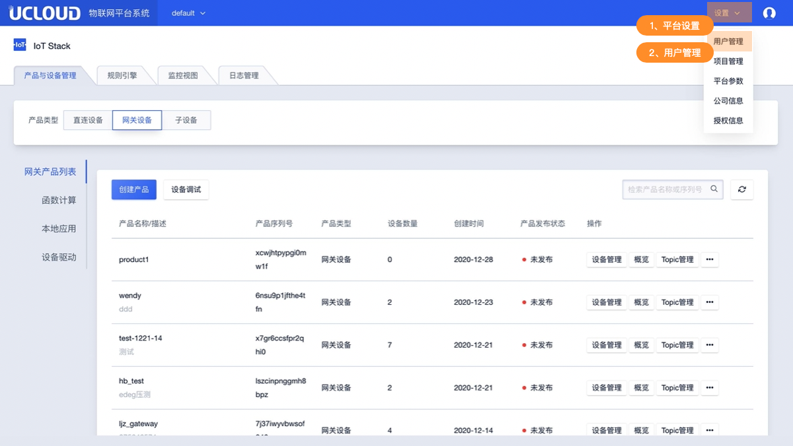
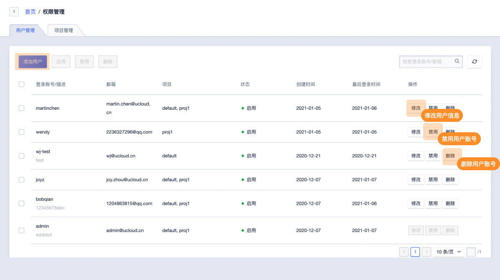
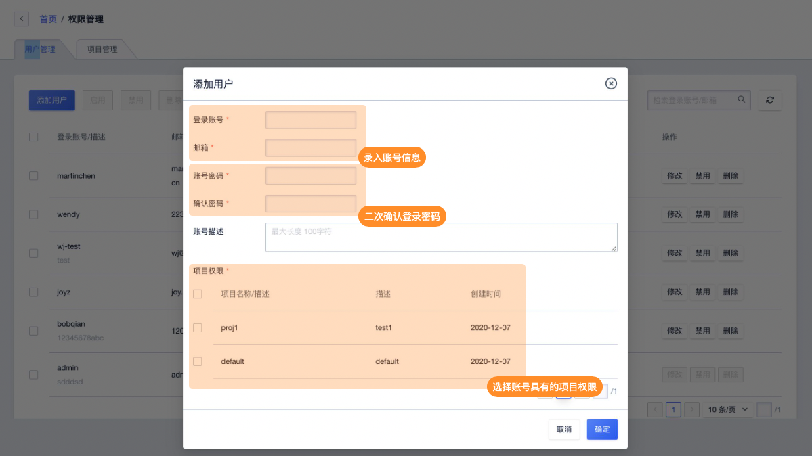
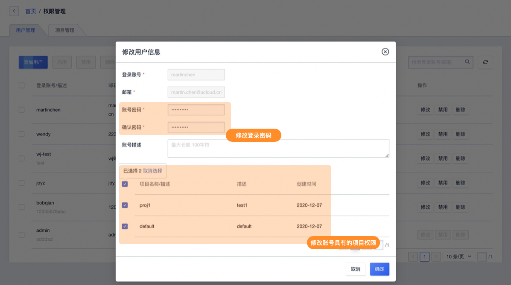

# 用户管理

IoT 平台支持多账号管理，管理员账号可创建其他账号用于分配不同人员对平台系统协作管理。

只有管理员账号（admin）具备用户管理权限，可创建或删除用户账号，并分账号拥有的项目权限。如用户账号下无任何项目权限则该账号将无法登录

## 一、用户管理说明及限制

* 用户管理仅管理员账号（admin）有创建、删除、修改并分配项目的权限操作
* 用户账号可修改该账号的的登录密码及账号描述
* 当用户账号未被分配任何项目时该账号无法登录
* 当用户账号被禁用时该账号无法登录
* 管理员账号（admin）无法被删除、修改、禁用

## 二、操作指南

### 1、用户管理主要功能概览

管理员账号（admin）登录后在系统首页点击右上角打开平台设置

用户管理主要功能如下图所示

### 2、添加用户

添加用户需录入相关信息如下

**录入信息说明**

* 其中登录账号及邮箱创建后不可修改
* 密码可设置8-20位英文数字的组合
* 项目权限可多选

### 3、修改账号信息

在用户管理页面选择需修改的账号即可修改账号信息。

**注意事项**

* 登录账号及邮箱创建后不可修改

### 4、禁用/启用账号

在用户管理页面选择账号即可进行禁用/启用的操作，账号被禁用后将无法登录。

### 5、删除账号

在用户管理页面选择账号即可进删除操作。