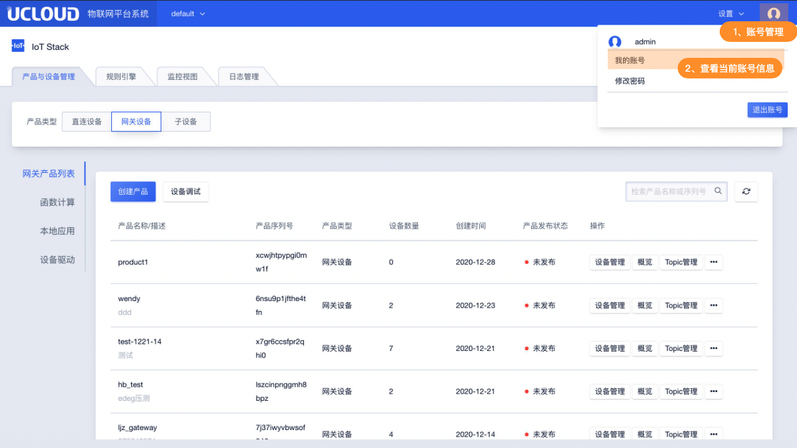
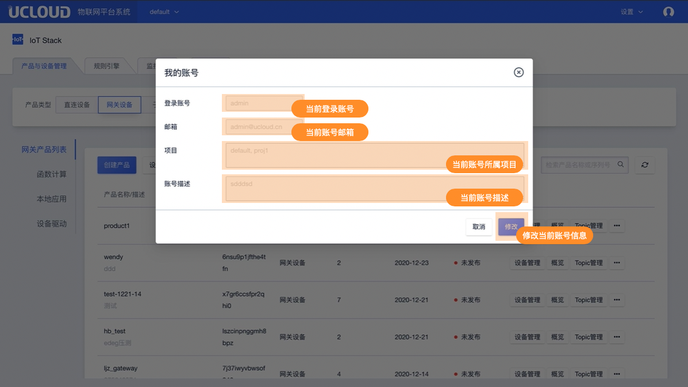
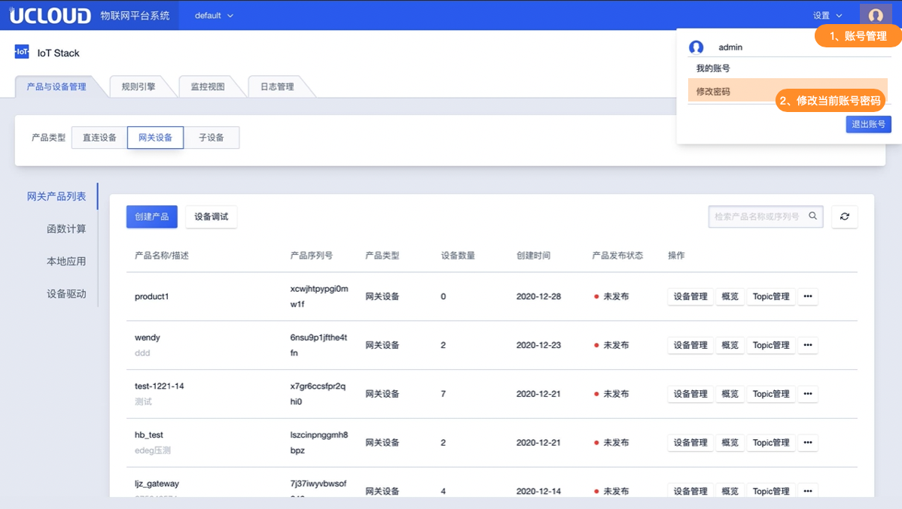
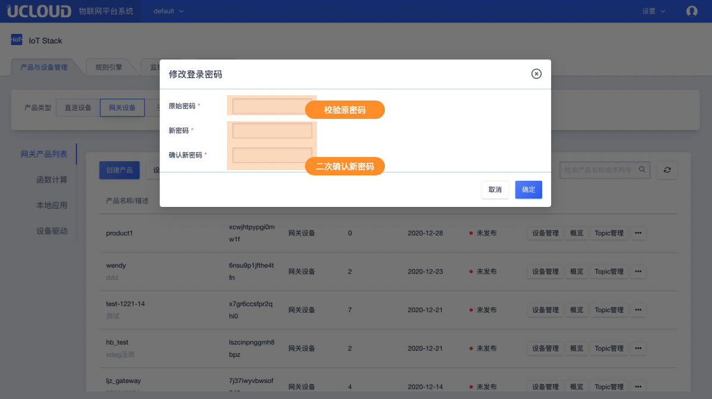

# 账号登录

## 一、登录界面

物联网平台套件部署完成后可通过Web控制台进行管理操作。

**登录界面**

**管理员账号**

管理员账号：admin

原始密码部：系统部署完成后UCloud会线下提供

**登录后首页**

## 二、账号相关操作

### 1、查看账号信息

系统首页点击右上角打开账号管理

**点击我的账号**

**查看当前账号信息**

### 2、修改当前账号密码

系统首页点击右上角打开账号管理

**点击修改密码**

**进行密码修改**

**密码规则**

密码可设置8-20位英文数字的组合