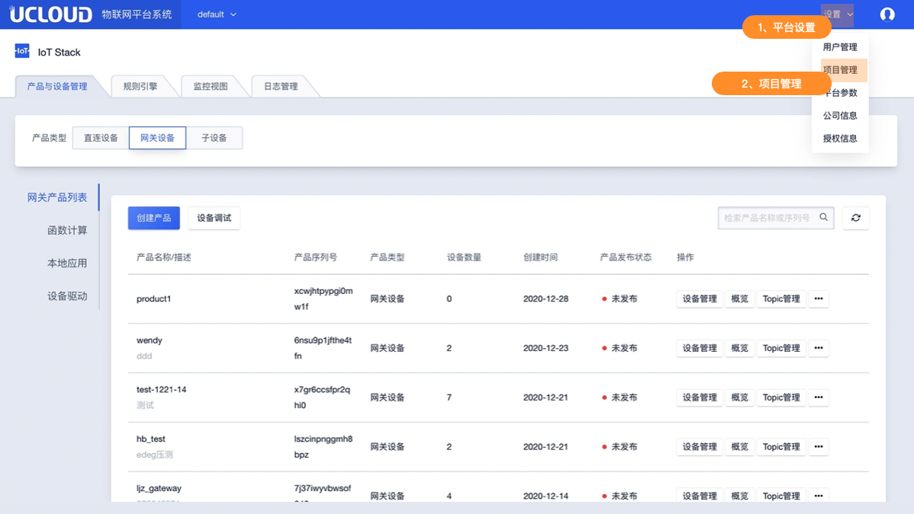
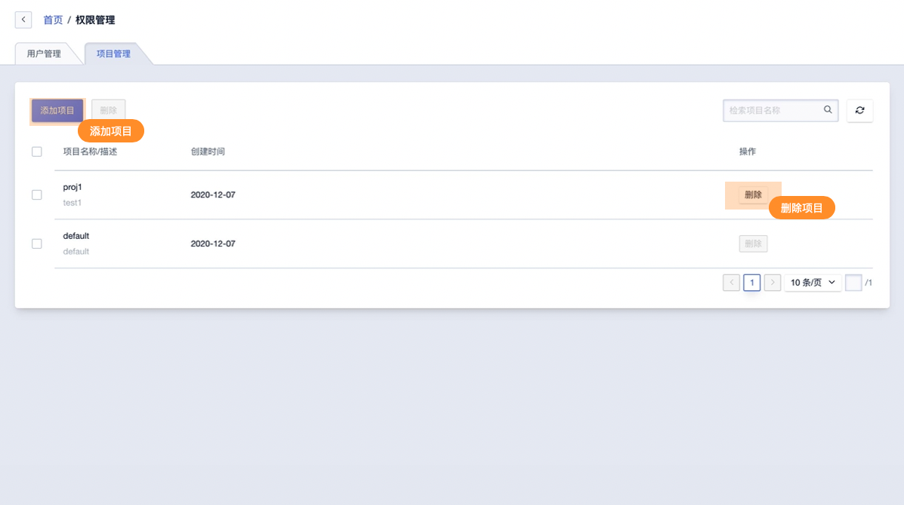
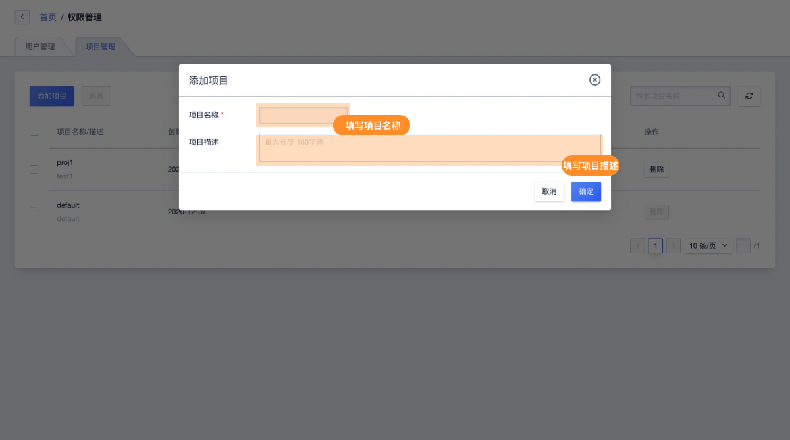

# 项目管理

项目可认为是IoT 平台承载产品设备管理等功能的容器。IoT平台中的产品与设备归属于项目管理，同一项目下可创建多个物联网产品。如某个账号具有某个项目的权限，则该账号可操作管理该项目下所有产品及设备。一个项目可分配给多个账号管理。

只有管理员账号（admin）具备项目管理权限可创建删除项目，并分配其他账号拥有的项目权限；同时管理员账号具有IoT平台的所有项目权限。

##一、项目管理说明及限制

* 项目管理仅管理员账号（admin）有创建删除分配的权限操作
* IoT平台可创建项目数量为？？？
* 一个项目可分配？？账号
* 一个项目可创建产品数量
* 当项目下有已经创建的产品时项目不可被删除
* 项目创建后不可修改名称及描述

## 二、项目管理相关操作

管理员账号（admin）登录后在系统首页点击右上角打开平台设置

###1、进入项目管理

###2、项目管理主要功能

**添加项目**

**删除项目**

* 当项目下有已经创建的产品时项目不可被删除

