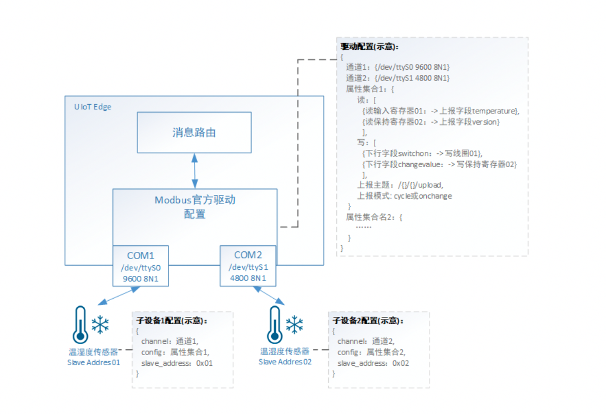

# 官方DL/T 645-2007驱动（C语言）

DL/T 645-2007是中国电力行业标准，是一种多功能电能表通信协议，该协议统一和规范了多功能电能表与数据终端设备进行数据交换时的连接方式和报文格式。

DL/T 645官方驱动目前支持数据的读取，用户通过自定义数据标识编码获取相应的参数值。需要写操作请联系在线客户或提工单咨询。

官方DLT/645 驱动基于RS-485 标准串行电气接口(本驱动可以Over TCP)编写，用户仅需配置数据表示编码及读取数据格式即可获取相应的监测数据。

## 官方驱动配置文件详解

使用官方DL/T 645驱动需要进行【驱动配置】和【子设备配置】。

【驱动配置】：配置通道信息、属性集合，对应DLT/645数据标识编码和上报json字段。

【子设备配置】：配置子设备所在通道及使用的属性集合。



### 驱动配置

#### 配置文件示例

```json
{
        "channel": {
            "com": {
                "method": "serial",
                "port": "/dev/ttyUSB0",
                "bytesize": 8,
                "stopbits": 1,
                "parity": "E",
                "baudrate": 2400,
                "timeout": 6,
                "period": 6,
                "time_wait": 0.07
            },
            "eth":{
                "method": "tcp",
                "address": "192.168.161.134",
                "port": 5000,
                "timeout": 8,
                "period": 5,
                "time_wait": 0.07
            }
        },
        "dlt645_config": {
            "read": [
                {
                    "code": "0x00010000",
                    "prop_list": [
                        {
                            "format": "XXXXXX.XX",
                            "name": "data.Sumpower",
                            "count": 4
                        }
                    ]
                }
            ],
            "write": {
                "downlink.hezha": {
                    "acition": "0x1C",
                    "control_code": "0x1B"
                },
                "download1.xie": {
                    "acition": "0x14",
                    "code": "0x04060001"
                }
            },
            "timestamp": "s",
            "preamble": true,
            "topic": "/{}/{}/upload",
            "write_reply_topic": "/{}/{}/upload",
            "mode": "cycle"
        }
    }CopyErrorSuccess
```

- channel: { channel1，channel2, ... } 表示不同的通道，名称可以自定义。
  - 当channel为串口时
    - method：必填，内容为“serial”
    - port：必填，使用串口设备，例如 "/dev/ttyS0"
    - baudrate：必填，串口波特率
    - bytesize：数据位长度，默认为8
    - parity：奇偶校验位，N - 不校验；O - 奇校验； E - 偶校验；M - 标记；S - 空间；默认为'E'
    - stopbits：停止位长度，默认为1
    - timtout：DLT645同一帧，设备响应的超时时间，单位为秒，支持小数，默认为3
    - time_wait：DLT645请求数据帧与帧之间的间隔时间，单位为秒，支持小数，默认为0.1
    - period：属性上报时间周期，单位为秒，支持小数，默认为30
  - 当channel为TCP时
    - method必填，内容为“tcp”
    - address：必填，内容为TCP地址，例如"192.168.161.134"
    - port：必填，内容为TCP端口号，例如 5000
    - timtout：DLT645同一帧，设备响应的超时时间，单位为秒，支持小数，默认为3
    - time_wait：DLT645请求数据帧与帧之间的间隔时间，单位为秒，支持小数，默认为0.1
    - period：属性上报时间周期，单位为秒，支持小数，默认为30
- dlt645_config表示属性集合配置，名称自定义
  - read：选填，定义需要读取的寄存器值并转换成json上报数据包，该项为数组
    - code：必填，数据表示编码，四字节十六进制，比如正向有功总电能，格式为**“0x00010000”**
    - prop_list：必填，设置DLT645与json的对应关系，prop_list为数组，按先后顺序根据count值决定读取第几个寄存器或第几个位
      - name：必填，自定义jsonpath或者`-`，代表数据上报到云端如何组成json包；当该字段为`-`时，代表跳过该count长度的寄存器或bit位
      - count：选填，默认值为1
      - format：必填，数据格式，比如**“XXXXXX.XX”**
  - write：选填，定义需要写入的寄存器值和对电表进行的操作
    - action: 必填，协议中对应的控制码，比如“0x14”表示写数据
    - control_code: 选填：对电表的控制命令类型，比如“0x1A”表示合闸
    - code: 选填，数据表示编码，四字节十六进制，比如，格式为**“0x04060001”**表示第一套第1阶梯值
  - name：必填，自定义jsonpath或者`-`，代表数据上报到云端如何组成json包；
  - timestamp: 选填，true/false，上报数据是否带时间戳，时间戳为Unix时间戳，默认值为false
  - topic：必填，定义上报消息使用的topic，topic格式为”/{}/{}/xxx“，该Topic可以为系统Topic、自定义Topic、网关本地Topic
  - mode：必填，采集数据模式，轮询模式 - “cycle”或者变化上报模式 - “onchange”
  - preamble：选填，true/false，发送报文是否需要包含前导符（4个FEH）
  - write_reply_topic：选填，定义回复写数据和控制命令的执行结果，topic格式为”/{}/{}/xxx“，该Topic可以为系统Topic、自定义Topic、网关本地Topic

#### 驱动转换后的数据格式

- 上行

  ```json
  // 上报数据根据name的json path进行组包上报数据
  {
      "data": {
          "SumPower":9873.34
      }
    "timestamp": 1597026387
  }CopyErrorSuccess
  ```

- 下行

  ```json
  // 组包发送给下行消息给子设备
  操作电表：
  {
    "downlink":{
        "hezha":{
            "password":"0x02000000",
            "opt_code":"0x01010101",
            "effect_time":"0x200916114050"
        }
    }
  }
  写数据：
  {
    "downlink":{
        "xie":{
            "password":"0x02000000",
            "opt_code":"0x01010101",
            "writedata":"0x12345678"
        }                                                   
    }                                                      
  }
  CopyErrorSuccess
  ```

  - password: 必填，表示操作密码，四字节16进制
  - opt_code: 必填，表示操作码，四字节16进制
  - effect_time: 操作电表必填，表示命令有效截止时间，格式“YYMMDDHHMMSS”六字节16进制，0x200916114050表示2020年09月16日11点40分50秒
  - writedata: 写数据必填，表示要写的数据，16进制

### 子设备配置

#### 子设备配置示例

```json
{
    "channel":"ttyUSB0",
    "config":"dlt645_config",
    "address":123456780018
}CopyErrorSuccess
```

- channel：必填，选择使用驱动配置中的哪个通道
- config：必填，选择使用驱动配置中的那个属性集合
- address：必填，设置该子设备的地址，实际BCD码地址

1. 