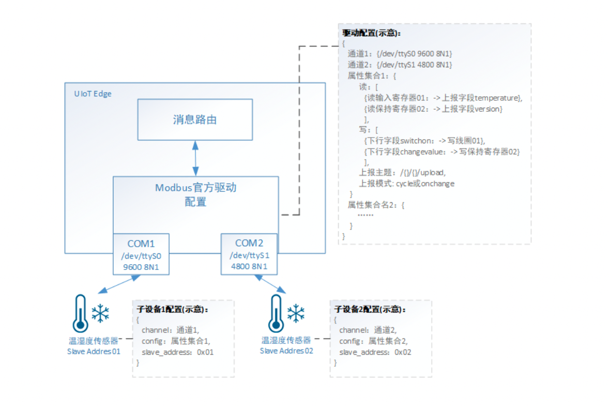

# 官方Modbus驱动（C语言版）

[Modbus](http://www.modbus.org/tech.php)最早由Modicon公司（现在的施耐德电气 ）于1979年为使用可编程逻辑控制器（PLC）通信而发表。Modbus已经成为工业、能源、楼宇、农业领域通信协议的业界标准，目前是工业电子设备之间常用的连接方式。

Modbus官方驱动目前支持Modbus RTU和Modbus TCP两种模式。

Modbus驱动C语言版支持三种CPU架构：arm64、arm7、amd64

C语言版本具有python版的绝大部分功能（除Modbus Binary Formate），且相比较python有以下优点：

1. 占用flash、RAM更小，运行速度更快，实时性更好；
2. 支持主动读属性；
3. 支持写操作返回是否成功reply；
4. 支持时间戳设置纳秒、毫秒、秒；

**Modbus 官方驱动支持以下功能：**

- 支持配置多通道、多传感器数据采集
- 支持通过自定义Topic上报数据，数据格式支持自定义json
- 支持下行读写命令
- 支持周期性上报（cycle）和数据变化上报（onchange）
- 支持设置上报周期，默认是30秒
- 支持连续读写多个寄存器
- 支持上报数据时间戳
- 支持Modbus功能码：
  - 02H 读离散输入寄存器(1x)
  - 04H 读输入寄存器(3x)
  - 01H 读线圈寄存器(0x)
  - 05H 写单个线圈寄存器(0x)
  - 03H 读保持寄存器(4x)
  - 06H 写单个保持寄存器(4x)
  - 0FH 写多个线圈寄存器(0x)
  - 10H 写多个保持寄存器(4x)

## 官方驱动配置文件详解

使用官方Modbus驱动需要进行【驱动配置】和【子设备配置】。

【驱动配置】：配置通道信息（/dev/ttyS0,9600,8N1 ...）、属性集合，对应Modbus命令和上报json字段。

【子设备配置】：配置子设备所在通道及使用的属性集合。



### 驱动配置

#### 配置文件示例

```json
{
    "channel": {
        "ttyUSB0": {
            "method": "serial",
            "format": "rtu",
            "port": "/dev/ttyUSB0",
            "baudrate": 9600,
            "time_wait": 0.3,
            "period": 5,
            "timtout": 3
        },
        "TCP9077": {
            "method": "tcp",
            "format": "socket",
            "address": "localhost",
            "port": 9077,
            "time_wait": 0.3,
            "period": 5,
            "timtout": 3
        }
    },

    "modbus_config": {
        "read": [{
                "action": "01H",
                "cmd": "read_status",                 // 主动获取当前值
                "address": "0x0001",
                "number": 1,
                "prop_list": [{
                    "name": "data.status",
                    "count": 1
                }]
            },
            {
                "action": "04H",
                "cmd": "read_temperature",            // 主动获取当前值
                "address": "0x0003",
                "number": 1,
                "prop_list": [{
                    "name": "data.temperature",
                    "count": 1,
                    "type": "int",
                    "scale": 0.1,
                    "offset": 0.0,
                    "swap16": true,
                    "swap32": false
                }]
            },
            {
                "action": "02H",
                "address": "0x0001",
                "number": 4,
                "prop_list": [{
                        "name": "device.input1_status",
                        "count": 1
                    },
                    {
                        "name": "device.input2_status",
                        "count": 1
                    },
                    {
                        "name": "device.input3_status",
                        "count": 1
                    },
                    {
                        "name": "device.input4_status",
                        "count": 1
                    }
                ]
            }
        ],
        "write": {
            "device.coil1": {
                "action": "05H",
                "address": "0x0001"
            },
            "device.coil2": {
                "action": "05H",
                "address": "0x0002"
            },
            "device.coil1_coil2": {
                "action": "0FH",
                "address": "0x0001"
            }
        },
        "timestamp": true,              //可选项包括：true "s" "ms" "ns", true默认为"s"
        "read_reply_topic": "/{}/{}/upload",
        "write_reply_topic": "/{}/{}/upload",
        "topic": "/{}/{}/upload",
        "mode": "cycle"
    }
}

主动获取下发cmd的格式：
{
    "action": "read",
    "operation": ["read_status","read_temperature"],
    "requestID": "123456"    // requestID可选
}CopyErrorSuccess
```

- channel: { channel1，channel2, ... } 表示不同的通道的自定义名称及Modbus报文格式。通道的配置分为数据传输层（method）和数据报文表示层（format）。通过数据传输层和数据报文表示层的不同组合可以组合成“Modbus RTU”，“Modbus ASCII”，“Modbus TCP”，“Modbus RTU over TCP”等不同形式。

  - format：必填，数据报文表示层的类型，包括"rtu"，"ascii"，"socket"三种，各个格式的具体介绍，参见[本节报文格式介绍](https://docs.ucloud.cn/uiot-edge/edge_development/offical_driver/offical_modbus_driver?id=format字段-报文格式介绍)

  - method：必填，使用数据传输层类型，包括"serial"，"tcp"，"udp"三种

    **当method选择为"serial"是，需要配置以下内容：**

    - port：必填，使用串口设备，例如 "/dev/ttyS0"
    - baudrate：必填，串口波特率
    - bytesize：数据位长度，默认为8
    - parity：奇偶校验位，N - 不校验；O - 奇校验； E - 偶校验；M - 标记；S - 空间；默认为'N'
    - stopbits：停止位长度，默认为1

    **当method选择为"tcp"或"udp"时，需要配置以下内容：**

    - address：必填，ip地址
    - port：必填，使用端口，例如 501

  - timeout：modbus同一帧，设备响应的超时时间，单位为秒，支持小数，默认为3

  - time_wait：modbus访问帧与帧之间的间隔时间，单位为秒，支持小数，默认为0.1

  - period：属性上报时间周期，单位为秒，支持小数，默认为30

- modbus_config 表示属性集合配置，名称自定义
  - read：选填，定义需要读取的寄存器值并转换成json上报数据包，该项为数组
    - action：必填，读功能码，可选为：**"01H","02H","03H","04H"**
    - commd：选填，读命令标识，用于下发主动读取该属性
    - address：必填，读寄存器地址
    - number：选填，读寄存器个数。number=1，代表读一个16bit数据
    - prop_list：必填，设置modbus与json的对应关系，prop_list为数组，按先后顺序根据count值决定读取第几个寄存器或第几个位
      - name：必填，自定义jsonpath或者`-`，代表数据上报到云端如何组成json包；当该字段为`-`时，代表跳过该count长度的寄存器或bit位
      - type：选填，json组包时的上报类型，支持int，uint，float，string，默认为 int；当读线圈或离散是，忽略该字段，默认为bool类型bool 数组
      - count：选填，默认值为1
      - scale：选填，缩放系数，将读取的值乘以scale上报
      - offset：选填，偏移系数，将读取的值加offset上报
      - swap16：选填，true/false，修改大小端，是否交换寄存器的高8位和低8位后再换算
      - swap32：选填，true/false，修改大小端，当寄存器count=2时，是否交换两个寄存器的数据后再换算
  - write：选填，定义写入寄存器值和下行json数据包对应的关系，该项为数组
    - device.coil1,device.coil2,device.coil1_coil2为jsonpath，用户根据自己需要组包的json的格式自定义
    - action：必填，写功能码，可选为：**"05H","06H","0FH","10H"**
    - address：必填，写寄存器地址
  - timestamp: 选填（默认值为false）
    - 布尔型：true/false，上报数据是否带时间戳，时间戳为Unix时间戳（秒）
      - 字符串：s/ms/ns，s为秒、ms为毫秒、ns为纳秒
  - topic：必填，定义上报消息使用的topic，topic格式为”/{}/{}/xxx“，该Topic可以为系统Topic、自定义Topic、网关本地Topic
  - mode：必填，采集数据模式，轮询模式 - “cycle”或者变化上报模式 - “onchange”
  - write_reply_topic：选填，定义下行写入寄存器或线圈的响应topic
  - read_reply_topic：选填，定义下行主动读寄存器或线圈的响应topic

##### 主动读属性消息数据格式

```json
// 主动获取属性下发cmd的格式：
{
  "action": "read",
  "operation": ["read_status","read_temperature"],
  "requestID": "123456"    // requestID可选
}CopyErrorSuccess
```

- action：选填，“read”时为下行读操作；默认为写操作
- operation：当下行为读操作时，内容为modbus_config 中read 列表中commd字段
- requestID：选填，当不为空时，响应带上requestID

#### 驱动转换后的数据格式

- 上行

  ```json
  // 上报数据根据prop_list中name的json path进行组包上报数据
  {
      "data": {
          "status": true,
          "temperature": 10
      },
      "device": {
          "input1_status": true,
          "input2_status": true,
          "input3_status": true,
          "input4_status": true
      },
      "timestamp": 1597026387
  }CopyErrorSuccess
  ```

- 下行

  ```json
  //写单个
  {
      "device": {
          "coil1": true,
          "coil2": true
      }
  }
  //写多个
  {
      "device": {
          "coil1_coil2": [true, false]
      }
  }CopyErrorSuccess
  ```

#### format字段--报文格式介绍

##### **1. rtu**

```
 [ Start Wait ] [Address ][ Function Code] [ Data ][ CRC ][  End Wait  ]
  3.5 chars       1b          1b               Nb     2b     3.5 charsCopyErrorSuccess
```

- 报文由时长至少3.5个字符时间的空间间隔区分
- 整个报文帧必须以连续的字符流发送，如果两个字符之间的空闲大于1.5个字符时间，则报文帧认为不完整，应该被接收点丢弃

| 波特率 | 1.5个字符(18 bits) | 3.5个字符(18 bits) |
| ------ | ------------------ | ------------------ |
| 1200   | 13333.3 us         | 31666.7 us         |
| 4800   | 3333.3 us          | 7916.7 us          |
| 9600   | 1666.7 us          | 3958.3 us          |
| 19200  | 833.3 us           | 1979.2 us          |
| 38400  | 416.7 us           | 989.6 us           |

1 字符 = start + 8 bits + parity + stop = 11 bits (1/波特率)*(bits) = delay seconds

##### **2. ascii**

```markup
[ Start ][Address ][ Function ][ Data ][ LRC ][ End ]
  1c         2c         2c        Nc      2c    2cCopyErrorSuccess
```

- 报文开头Start为英文冒号”:”（3A）
- 报文结尾End为”\r”（0D）、”\n”（0A）
- 报文数据用ascii的方式表示十六进制的 0-9，A-F

##### **3. socket**

```
[         MBAP Header         ] [ Function Code] [ Data ] 
[ tid ][ pid ][ length ][ uid ]
  2b     2b     2b        1b           1b           NbCopyErrorSuccess
```

- MBAP为报文头，共计7字节
- tid - 事务处理标识：为报文的序列号，一般每次通信之后就要加1以区别不同的通信数据报文
- pid - 协议标识符：00 00表示ModbusTCP协议
- length - 长度：表示接下来的数据长度，单位为字节
- uid - 单元标识符：可以理解为设备地址

##### **4. binary**

```
[ Start ][Address ][ Function ][ Data ][ CRC ][ End ]
   1b        1b         1b        Nb      2b    1bCopyErrorSuccess
```

- 报文以'{'开始，以 '}'结束
- 二进制格式和RTU除了开始和结束，其他数据没有区别

##### 配置组合示例：

| Modbus形式          | 配置                                                         |
| ------------------- | ------------------------------------------------------------ |
| Modbus RTU          | "channel": { "ttyUSB0": { "method": "serial", "format": "rtu", "port": "/dev/ttyUSB0", "baudrate": 9600, "time_wait": 0.3, "period": 5, "timtout": 3 } } |
| Modbus TCP          | "channel": { "TCP502": { "method": "tcp", "format": "socket", "address": "192.168.1.13", "port": 502, "time_wait": 0.3, "period": 5, "timtout": 3 } } |
| Modbus RTU over TCP | "channel": { "TCP503": { "method": "tcp", "format": "rtu", "address": "192.168.1.14", "port": 503, "time_wait": 0.3, "period": 5, "timtout": 3 } } |

### 子设备配置

#### 子设备配置示例

```json
{
    "channel":"ttyUSB0",
    "config":"modbus_config",
    "slave_address":1
}CopyErrorSuccess
```

- channel：必填，选择使用驱动配置中的哪个通道
- config：必填，选择使用驱动配置中的那个属性集合
- slave_address：必填，设置该子设备的从地址

1. 